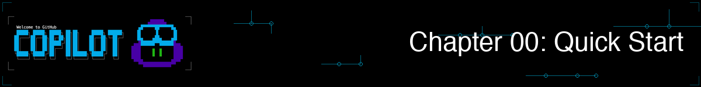

歡迎！在本章中，你將安裝 GitHub Copilot CLI (命令列介面)、使用你的 GitHub 帳號登入，並驗證一切運作正常。這是一個快速設定章節。一旦你準備就緒，真正的展示將在第 01 章開始！

## 🎯 學習目標

到本章結束時，你將完成：

- 安裝 GitHub Copilot CLI
- 使用你的 GitHub 帳號登入
- 透過簡單的測試驗證其運作正常

> ⏱️ **預估時間**：~10 分鐘 (5 分鐘閱讀 + 5 分鐘動手實作)

---

## ✅ 先決條件

- **GitHub 帳號** 並具備 Copilot 存取權限。[查看訂閱選項](https://github.com/features/copilot/plans)。學生/教師可以透過 [GitHub Education 免費存取](https://education.github.com/pack) Copilot Pro。
- **終端機基礎**：熟悉 `cd` 和 `ls` 等指令

### 「Copilot 存取權限」的意義

GitHub Copilot CLI 需要有效的 Copilot 訂閱。你可以在 [github.com/settings/copilot](https://github.com/settings/copilot) 檢查你的狀態。你應該會看到以下其中之一：

- **Copilot Individual** - 個人訂閱
- **Copilot Business** - 透過你的組織
- **Copilot Enterprise** - 透過你的企業
- **GitHub Education** - 對經過驗證的學生/教師免費

如果你看到「你沒有 GitHub Copilot 的存取權限」，你將需要使用免費選項、訂閱方案，或加入提供存取權限的組織。

---

## 安裝

> ⏱️ **時間預估**：安裝需要 2-5 分鐘。驗證需要另外 1-2 分鐘。

### GitHub Codespaces (零設定)

如果你不想安裝任何先決條件，可以使用 GitHub Codespaces，它已經準備好 GitHub Copilot CLI (你需要登入)，預先安裝了 Python 和 pytest。

1. 將 [此儲存庫分叉 (Fork)](https://github.com/github/copilot-cli-for-beginners/fork) 到你的 GitHub 帳號
2. 選擇 **Code** > **Codespaces** > **Create codespace on main**
3. 等待幾分鐘讓容器建構完成
4. 你準備好了！終端機將在 Codespace 環境中自動開啟。

> 💡 **在 Codespace 中驗證**：執行 `cd samples/book-app-project && python book_app.py help` 以確認 Python 和範例應用程式運作正常。

### 本機安裝

如果你想在本機執行 Copilot CLI 並搭配課程範例，請按照下列步驟。

1. 將儲存庫複製到本機以取得課程範例：

    ```bash
    git clone https://github.com/github/copilot-cli-for-beginners
    cd copilot-cli-for-beginners
    ```

2. 使用下列其中一種方式安裝 Copilot CLI：

    > 💡 **不確定要選哪一種？** 如果你已安裝 Node.js，請使用 `npm`。否則選擇符合你系統的安裝方式。

    ### 所有平台（npm）

    ```bash
    # 如果你已安裝 Node.js，這是快速取得 CLI 的方式
    npm install -g @github/copilot
    ```

    ### macOS／Linux（Homebrew）

    ```bash
    brew install copilot-cli
    ```

    ### Windows（WinGet）

    ```bash
    winget install GitHub.Copilot
    ```

    ### macOS／Linux（安裝腳本）

    ```bash
    curl -fsSL https://gh.io/copilot-install | bash
    ```

<details>
<summary>可選：啟用 shell 補全</summary>

Shell 補全允許你按下 **Tab** 鍵來補完 `copilot` 子指令、命令選項，以及部分選項值。這是可選功能，但當你熟悉 CLI 後會很方便。

Copilot CLI 目前支援 Bash、Zsh 與 Fish 的補全腳本：

```shell
# Bash，僅針對當前工作階段
source <(copilot completion bash)

# Bash，於 Linux 上持久生效
copilot completion bash | sudo tee /etc/bash_completion.d/copilot

# Zsh
copilot completion zsh > "${fpath[1]}/_copilot"

# Fish
copilot completion fish > ~/.config/fish/completions/copilot.fish
```

在新增持久性補全後請重新啟動你的 shell。PowerShell 可用於在 Windows 上執行 Copilot CLI，但 `copilot completion` 目前僅支援 Bash、Zsh 與 Fish。

</details>

---

## 驗證

在 `copilot-cli-for-beginners` 儲存庫的根目錄開啟終端機視窗，啟動 CLI 並允許存取該資料夾。

```bash
copilot
```

系統會詢問你是否信任包含儲存庫的資料夾 (如果你尚未信任)。你可以信任一次或在所有未來的階段中信任。


信任資料夾後，你可以使用你的 GitHub 帳號登入。

```
> /login
```

**接下來會發生什麼：**

1. Copilot CLI 顯示一個一次性代碼 (例如 `ABCD-1234`)
2. 你的瀏覽器會開啟 GitHub 的裝置授權頁面。如果你尚未登入 GitHub，請登入。
3. 在提示時輸入代碼
4. 選擇「Authorize」以授予 GitHub Copilot CLI 存取權限
5. 返回你的終端機 - 你現在已登入！


*裝置授權流程：你的終端機產生一個代碼，你在瀏覽器中驗證它，然後 Copilot CLI 獲得驗證。*

**提示**：登入會在不同階段之間保持。除非你的權杖過期或你明確登出，否則你只需要執行一次。

---

## 驗證其運作正常

### 步驟 1：測試 Copilot CLI

現在你已登入，讓我們驗證 Copilot CLI 是否為你正常運作。在終端機中，如果尚未啟動 CLI，請啟動它：

```bash
> Say hello and tell me what you can help with
```

收到回應後，你可以退出 CLI：

```bash
> /exit
```

---

<details>
<summary>🎬 看看它的實際運作！</summary>


*展示輸出會有所不同。你的模型、工具和回應將與此處顯示的內容不同。*

</details>

---

**預期輸出**：一個列出 Copilot CLI 功能的友好回應。

### 步驟 2：執行範例圖書應用程式

課程提供了一個範例應用程式，你將在整個課程中使用 CLI 探索並改進它 *(你可以在 /samples/book-app-project 中查看此程式碼)*。在開始之前，請檢查 *Python 圖書收藏終端機應用程式* 是否運作正常。根據你的系統執行 `python` 或 `python3`。

> **注意：** 本課程中的主要範例使用 Python (`samples/book-app-project`)，如果你選擇此項目，請在本機安裝 [Python 3.10+](https://www.python.org/downloads/)（Codespace 已預先安裝）。若你偏好其他語言，也提供 JavaScript (`samples/book-app-project-js`) 與 C# (`samples/book-app-project-cs`) 版本。每個範例資料夾皆包含 README，說明如何在該語言環境中執行應用程式。

```bash
cd samples/book-app-project
python book_app.py list
```

**預期輸出**：包含 "The Hobbit"、"1984" 和 "Dune" 在內的 5 本書清單。

### 步驟 3：使用 Copilot CLI 嘗試圖書應用程式

先導航回儲存庫根目錄 (如果你執行了步驟 2)：

```bash
cd ../..   # 如果需要，返回儲存庫根目錄
copilot 
> What does @samples/book-app-project/book_app.py do?
```

**預期輸出**：圖書應用程式主要函式和指令的摘要。

如果你看到錯誤，請檢查下方的 [疑難排解章節](#疑難排解)。

完成後，你可以退出 Copilot CLI：

```bash
> /exit
```

---

## ✅ 你準備好了！

安裝到此結束。真正的樂趣從第 01 章開始，在那裡你將：

- 觀看 AI 審查圖書應用程式並立即發現程式碼品質問題
- 學習使用 Copilot CLI 的三種不同方式
- 從純英文產生可執行的程式碼

**[繼續前往第 01 章：第一步 →](../01-setup-and-first-steps/README.md)**

---

## 疑難排解

### 「copilot: command not found」

CLI 尚未安裝。請嘗試不同的安裝方法：

```bash
# 如果 brew 失敗，請嘗試 npm：
npm install -g @github/copilot

# 或安裝指令碼：
curl -fsSL https://gh.io/copilot-install | bash
```

### 「你沒有 GitHub Copilot 的存取權限」

1. 在 [github.com/settings/copilot](https://github.com/settings/copilot) 驗證你是否擁有 Copilot 訂閱
2. 如果使用工作帳號，請檢查你的組織是否允許 CLI 存取

### 「驗證失敗」

重新驗證：

```bash
copilot
> /login
```

### 瀏覽器未自動開啟

手動造訪 [github.com/login/device](https://github.com/login/device) 並輸入終端機中顯示的代碼。

### 權杖過期

只需再次執行 `/login`：

```bash
copilot
> /login
```

### 仍然卡住了？

- 檢查 [GitHub Copilot CLI 文件](https://docs.github.com/copilot/concepts/agents/about-copilot-cli)
- 搜尋 [GitHub Issues](https://github.com/github/copilot-cli/issues)

---

## 🔑 重要關鍵

1. **GitHub Codespace 是快速入門的方法** - 預先安裝了 Python、pytest 和 GitHub Copilot CLI，因此你可以直接進入展示
2. **多種安裝方法** - 選擇適合你系統的方法 (Homebrew、WinGet、npm 或安裝指令碼)
3. **一次性驗證** - 登入會持續到權杖過期為止
4. **圖書應用程式可運作** - 你將在整個課程中使用 `samples/book-app-project`

> 📚 **官方文件**：[安裝 Copilot CLI](https://docs.github.com/copilot/how-tos/copilot-cli/cli-getting-started) 以獲取安裝選項和要求。

> 📋 **快速參考**：查看 [GitHub Copilot CLI 指令參考](https://docs.github.com/en/copilot/reference/cli-command-reference) 以獲取指令和快速鍵的完整清單。

---

**[繼續前往第 01 章：第一步 →](../01-setup-and-first-steps/README.md)**
