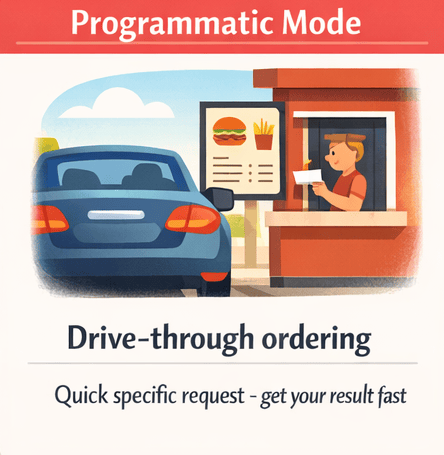

<!--
---
id: CopilotCLI-01
title: !translate 第一步
description: !translate 透過動手演示體驗 GitHub Copilot CLI，然後學習何時使用互動式、計劃式和程序化模式。
audience: 開發者 / 學生 / 終端用戶
slug: first-steps
weight: 2
---
-->


> **觀看 AI 立即發現程式碼漏洞、解釋令人困惑的程式碼並產生可執行的指令碼。接著學習使用 GitHub Copilot CLI 的三種不同方式。**

本章是奇蹟開始的地方！你將親身體驗為什麼開發者將 GitHub Copilot CLI 描述為就像隨時待命的資深工程師。你將看到 AI 在幾秒鐘內發現安全漏洞、以白話英文解釋複雜的程式碼，並立即產生可執行的指令碼。接著你將掌握三種互動模式 (互動式、計畫式和程式化)，讓你確切知道任何任務該使用哪一種模式。

> ⚠️ **先決條件**：請確保你已先完成 **[第 00 章：快速入門](../00-quick-start/README.md)**。在執行下方的展示之前，你需要安裝 GitHub Copilot CLI 並完成驗證。

## 🎯 學習目標

到本章結束時，你將能夠：

- 透過動手實作展示體驗 GitHub Copilot CLI 提供的生產力提升
- 為任何任務選擇正確的模式 (互動式、計畫式或程式化)
- 使用斜線指令來控制你的階段

> ⏱️ **預估時間**：~45 分鐘 (15 分鐘閱讀 + 30 分鐘動手實作)

---

# 你的第一次 Copilot CLI 體驗


直接進入並看看 Copilot CLI 能做什麼。

---

## 輕鬆上手：你的第一個提示

在深入研究令人印象深刻的展示之前，讓我們從一些你現在就可以嘗試的簡單提示開始。**不需要程式碼儲存庫**！只需開啟終端機並啟動 Copilot CLI：

```bash
copilot
```

嘗試這些對初學者友好的提示：

```
> Explain what a dataclass is in Python in simple terms

> Write a function that sorts a list of dictionaries by a specific key

> What's the difference between a list and a tuple in Python?

> Give me 5 best practices for writing clean Python code
```

不使用 Python？沒問題！只需詢問關於你選擇的語言的問題即可。

注意這感覺有多麼自然。只需像詢問同事一樣提出問題。當你完成探索後，輸入 `/exit` 即可離開階段。

**核心洞察**：GitHub Copilot CLI 是對話式的。你不需要特殊的語法即可開始。只需用白話英文提問即可。

## 看看它的實際運作

現在讓我們看看為什麼開發者稱之為「隨時待命的資深工程師」。

> 📖 **閱讀範例**：以 `>` 開頭的行是你進入互動式 Copilot CLI 階段後輸入的提示。沒有 `>` 前綴的行是你需要在終端機中執行的 Shell 指令。

> 💡 **關於範例輸出**：本課程中顯示的範例輸出僅供說明之用。由於 Copilot CLI 的回應每次都會有所不同，因此你的結果在措辭、格式和細節上會有所不同。請關注返回的資訊*類型*，而非確切的文字。

### 展示 1：幾秒鐘內完成程式碼審查

本課程包含帶有刻意程式碼品質問題的範例檔案。如果您在本機工作且尚未複製此儲存庫，請執行下列 `git clone` 指令，進入 `copilot-cli-for-beginners` 資料夾，然後執行 `copilot` 指令。

```bash
# 如果你是在本地工作且尚未複製，請複製課程儲存庫
git clone https://github.com/github/copilot-cli-for-beginners
cd copilot-cli-for-beginners

# 啟動 Copilot
copilot
```

進入 Copilot CLI 互動階段後，執行以下：

```
> Review @samples/book-app-project/book_app.py for code quality issues and suggest improvements
```

> 💡 **`@` 是符號用來做什麼？** `@` 符號告訴 Copilot CLI 讀取檔案。你將在第 02 章中學習所有相關內容。目前，只需完全按照所示方式複製指令即可。

---

<details>
<summary>🎬 看看它的實際運作！</summary>


*展示輸出會有所不同。你的模型、工具和回應將與此處顯示的內容不同。*

</details>

---

**重點**：在幾秒鐘內完成專業的程式碼審查。手動審查將會花費...嗯...比這更多的時間！

---

### 展示 2：解釋令人困惑的程式碼

是否曾盯著程式碼疑惑它在做什麼？在你的 Copilot CLI 階段中嘗試這個：

```
> Explain what @samples/book-app-project/books.py does in simple terms
```

---

<details>
<summary>🎬 看看它的實際運作！</summary>


*展示輸出會有所不同。你的模型、工具和回應將與此處顯示的內容不同。*

</details>

---

**發生了什麼**：(你的輸出將會不同) Copilot CLI 讀取檔案、理解程式碼，並用白話英文進行解釋。

```
這是一個使用 Python dataclasses 的圖書收藏管理模組。

將其想像成一個數位書架：
- Book 是一個 dataclass - 儲存圖書資訊 (標題、作者、年份、閱讀狀態) 的簡單方法
- BookCollection 管理整個收藏並處理儲存/載入

關鍵元件：

1. @dataclass 裝飾器 (第 8 行)
   - 自動建立 __init__、__repr__ 等。
   - 在 Python 中定義資料結構的簡潔方式

2. BookCollection 類別 (第 16 行)
   - 維護 Book 物件清單
   - 透過 JSON 檔案 I/O 處理持續性
   - load_books() 從 data.json 讀取資料
   - save_books() 使用 asdict() 寫入 data.json

3. 圖書操作：
   - add_book() - 建立並儲存新書
   - find_book_by_title() - 搜尋收藏
   - mark_as_read() - 更新閱讀狀態
   - find_by_author() - 依作者姓名篩選

常見模式：從 JSON 讀取 → 使用 Python 物件作業 → 寫回 JSON
```

**重點**：複雜的程式碼會像耐心的導師解釋一樣被解釋清楚。

---

### 展示 3：產生可執行的程式碼

需要一個平時可能需要花 15 分鐘 Google 的函式嗎？仍在你的階段中：

```
> Write a Python function that takes a list of books and returns statistics: 
  total count, number read, number unread, oldest and newest book
```

---

<details>
<summary>🎬 看看它的實際運作！</summary>


*展示輸出會有所不同。你的模型、工具和回應將與此處顯示的內容不同. *

</details>

---

**發生了什麼**：在幾秒鐘內完成一個完整、可執行的函式，你可以直接複製-貼上-執行。

完成探索後，退出階段：

```
> /exit
```

**重點**：即時獲得成果，且你全程保持在同一個連續的階段中。

---

# 模式與指令


你剛剛看到了 Copilot CLI 能做什麼。現在讓我們瞭解*如何*有效地使用這些功能。關鍵是知道在不同情況下應使用三種互動模式中的哪一種。

> 💡 **注意**：Copilot CLI 還有一個 **Autopilot** 模式，它可以在不等待你輸入的情況下完成任務。它功能強大，但需要授予完整權限並會自主使用進階請求。本課程重點介紹下方的三種模式。一旦你熟悉了基礎知識，我們將引導你前往 Autopilot。

---

## 🧩 現實世界的類比：外出用餐

將使用 GitHub Copilot CLI 想像成外出用餐。從計畫行程到下訂單，不同的情況需要不同的方法：

| 模式 | 用餐類比 | 何時使用 |
|------|----------------|-------------|
| **計畫 (Plan)** | 前往餐廳的 GPS 路線 | 複雜任務 - 規劃路線、審查停靠點、達成計畫共識，然後開車 |
| **互動 (Interactive)** | 與服務生交談 | 探索與迭代 - 提問、自訂、取得即時回饋 |
| **程式化 (Programmatic)** | 得來速點餐 | 快速、具體的任務 - 留在你的環境中，快速取得結果 |

就像外出用餐一樣，你自然會學會每種方法何時感覺合適。


*根據任務選擇你的模式：計畫模式用於先規劃，互動模式用於來回協作，程式化模式用於快速取得一次性結果*

### 我應該從哪種模式開始？

**從互動 (Interactive) 模式開始。**
- 你可以進行實驗並提出後續問題
- 內容透過對話自然建立
- 錯誤很容易透過 `/clear` 修正

一旦你習慣後，請嘗試：
- **程式化 (Programmatic) 模式** (`copilot -p "<你的提示>"`) 用於快速、一次性的問題
- **計畫 (Plan) 模式** (`/plan`) 當你在編寫程式碼之前需要更詳細地規劃時

---

## 三種模式

### 模式 1：互動 (Interactive) 模式 (從這裡開始)


**最適合**：探索、迭代、多輪對話。就像與可以回答問題、接受回饋並隨時調整訂單的服務生交談一樣。

啟動互動階段：

```bash
copilot
```

正如你目前所看到的，你會看到一個提示符號，你可以在其中自然地輸入。要獲取可用指令的協助，只需輸入：

```
> /help
```

**核心洞察**：互動模式會維護內容。每條訊息都建立在先前的訊息之上，就像真正的對話一樣。

#### 互動模式範例

```bash
copilot

> Review @samples/book-app-project/utils.py and suggest improvements

> Add type hints to all functions

> Make the error handling more robust

> /exit
```

注意每個提示是如何建立在先前回答的基礎之上的。你正在進行對話，而不是每次都重新開始。

---

### 模式 2：計畫 (Plan) 模式


**最適合**：需要在執行前審查方法的複雜任務。類似於在旅行前使用 GPS 規劃路線。

計畫模式可協助你在編寫任何程式碼之前建立逐步計畫。使用 `/plan` 指令，按下 **Shift+Tab** 以循環切換至計畫模式：

```bash
copilot

> /plan Add a "mark as read" command to the book app
```

> 💡 **提示**：**Shift+Tab** 可在模式之間切換：互動 → 計畫 → Autopilot。在互動階段期間隨時按下它即可切換模式而無需輸入指令。

您也可以使用 `--plan` 旗標直接以計畫模式啟動 Copilot CLI：

```bash
copilot --plan
```

**計畫模式輸出**：(你的輸出可能不同)

```
📋 實作計畫

步驟 1：更新 book_app.py 中的指令處理程式
  - 為 "mark" 指令新增 elif 分支
  - 建立 handle_mark_as_read() 函式

步驟 2：實作處理程式函式
  - 提示使用者輸入圖書標題
  - 呼叫 collection.mark_as_read(title)
  - 顯示成功/失敗訊息

步驟 3：更新說明文字
  - 將 "mark" 新增至可用指令清單
  - 文件化指令用法

步驟 4：測試流程
  - 新增一本書
  - 將其標記為已讀
  - 驗證清單輸出中的狀態變化

是否繼續執行實作？ [Y/n]
```

**核心洞察**：計畫模式讓您在撰寫任何程式碼之前，先檢視並修改方法。在計畫模式中，Copilot CLI 是**唯讀**的，在您批准並進入實作之前，它不會編輯任何檔案或執行會變更您工作區的指令。這能讓您安全地保持在「思考」階段，直到您準備就緒。一旦計畫完成，您甚至可以要求 Copilot CLI 將其儲存到檔案中以供日後參考。例如，「將此計畫儲存至 `mark_as_read_plan.md`」將會建立一個包含計畫詳細資訊的 Markdown 檔案。

> 💡 **想要更複雜的東西嗎？** 嘗試：`/plan Add search and filter capabilities to the book app`。計畫模式可從簡單的功能擴展到完整的應用程式。

> 📚 **Autopilot 模式**：您可能已注意到，Shift+Tab 會輪換至第三種模式——**Autopilot**。在 Autopilot 模式中，Copilot 會執行完整計畫，不會在每個步驟後等待您的輸入——就像把工作交給同事，並告訴對方「完成後再通知我」。典型的工作流程是「計畫 → 接受 → Autopilot」，這表示您需要先熟悉如何撰寫計畫。您也可以使用 `copilot --autopilot` 直接啟動 Autopilot，或透過 `/autopilot <objective>` 內嵌指定目標（例如 `/autopilot Add a search command to the book app`）。您也可以執行 `copilot --plan --mode autopilot`，結合計畫與 Autopilot。Copilot 會先建立計畫，接著自動執行，不會暫停等待核准。請先熟悉互動模式與計畫模式，準備好後再參閱[官方文件](https://docs.github.com/copilot/concepts/agents/copilot-cli/autopilot)。

---

### 模式 3：程式化 (Programmatic) 模式



**最適合**：自動化、指令碼、CI/CD、單次指令。就像使用得來速快速點餐一樣，不需要與服務生交談。

對於不需要互動的一次性指令，請使用 `-p` 旗標：

```bash
# 產生程式碼
copilot -p "Write a function that checks if a number is even or odd"

# 取得快速協助
copilot -p "How do I read a JSON file in Python?"
```

**核心洞察**：程式化模式為你提供快速回答並結束。沒有對話，只有輸入 → 輸出。

<details>
<summary>📚 <strong>進階：在指令碼中使用程式化模式</strong> (點擊展開)</summary>

一旦你熟悉之後，就可以在 Shell 指令碼中使用 `-p`：

```bash
#!/bin/bash

# 自動產生提交訊息
COMMIT_MSG=$(copilot -p "Generate a commit message for: $(git diff --staged)")
git commit -m "$COMMIT_MSG"

# 審查檔案
copilot --allow-all -p "Review @myfile.py for issues"
```
> ⚠️ **關於 `--allow-all`**：此旗標會跳過所有權限提示，讓 Copilot CLI 在不事先詢問的情況下讀取檔案、執行指令和存取 URL。這對於程式化模式 (`-p`) 是必要的，因為沒有互動階段來核准操作。僅在你自己編寫的提示中使用 `--allow-all`，且是在你信任的目錄中。切勿在不受信任的輸入或敏感目錄中使用它。

</details>

---

## 必學斜線指令

開始使用 Copilot CLI 時，這些指令非常值得優先學習：

| 指令 | 功能 | 使用時機 |
|---------|--------------|-------------|
| `/ask` | 快速提問，不影響對話記錄 | 想快速取得答案，又不想打斷目前的工作時 |
| `/clear` | 清除對話並重新開始 | 切換主題時 |
| `/config` | 檢視或設定持久化預設值（例如預設模型） | 想讓設定套用至所有未來工作階段時 |
| `/help` | 顯示所有可用指令 | 忘記指令時 |
| `/model` | 顯示或切換目前工作階段的 AI 模型 | 想變更 AI 模型時 |
| `/plan` | 在撰寫程式碼前規劃工作 | 處理較複雜的功能時 |
| `/refine` | 將粗略、漫無章法的提示詞改寫成清楚且聚焦的內容 | 提示詞雜亂、想取得更好結果時 |
| `/research` | 使用 GitHub 和網路來源進行深入研究 | 撰寫程式碼前需要調查主題時 |
| `/exit` | 結束工作階段 | 完成工作時 |

> 💡 **`/ask` 與一般聊天的差異**：通常你傳送的每則訊息都會成為目前對話的一部分，並影響後續回應。`/ask` 是一個「不留紀錄」的快速方式，非常適合用於 `/ask YAML 是什麼意思？` 這類不影響工作階段內容的單次問題。

> 💡 **使用 `/refine` 改善提示詞**：不確定提示詞是否夠清楚嗎？先照你想到的方式輸入，再執行 `/refine`，讓 Copilot 在送出前將它改寫成精確且結構良好的提示詞。對剛接觸 AI 工具、仍在學習撰寫有效提示詞的人特別有幫助。

> 💡 **Tab 自動完成**：輸入斜線指令時，按下 **Tab** 可自動完成指令名稱，或切換可用的子指令和引數。記不清指令完整名稱時特別方便。

> 💡 **在 Copilot 忙碌時排入提示詞**：如果 Copilot 正在執行工作，而你想到下一件想讓它處理的事，只要輸入內容並按下 **Enter** 即可。Copilot 會在目前工作完成後自動執行，不必等待。

以上就是入門內容！熟悉之後，可以繼續探索其他指令。

> 📚 **官方文件**：[CLI 指令參考](https://docs.github.com/copilot/reference/cli-command-reference)提供完整的指令和旗標清單。

<details>
<summary>📚 <strong>其他指令</strong>（點擊展開）</summary>

> 💡 上述必學指令已涵蓋許多日常使用情境。準備好探索更多功能時，可參考以下內容。

### 代理程式環境

| 指令 | 功能 |
|---------|--------------|
| `/agent` | 瀏覽並選取可用的代理程式 |
| `/env` | 顯示已載入的環境詳細資料——目前啟用的指示、MCP 伺服器、技能、代理程式和外掛程式 |
| `/init` | 初始化存放庫的 Copilot 指示 |
| `/instructions` | 檢視並管理目前工作階段已載入的所有指示檔案 |
| `/mcp` | 開啟外掛程式儀表板（聚焦於 MCP 伺服器）；使用 `/mcp config` 開啟專用的 MCP 設定精靈 |
| `/plugin` | 開啟外掛程式儀表板，以瀏覽、安裝、啟用及更新外掛程式 |
| `/settings` | 開啟互動式對話方塊，在同一處瀏覽及編輯所有使用者設定 |
| `/skills` | 開啟外掛程式儀表板（聚焦於技能），以探索及管理技能 |
| `/subagents` | 檢視並管理目前工作階段中執行的子代理程式 |

> 💡 代理程式請參閱[第 04 章](../04-agents-custom-instructions/README.md)，技能請參閱[第 05 章](../05-skills/README.md)，MCP 伺服器請參閱[第 06 章](../06-mcp-servers/README.md)。

### 模型與子代理程式

| 指令 | 功能 |
|---------|--------------|
| `/config` | 檢視或設定持久的預設值（例如使用 `/config model` 設定所有未來工作階段的預設模型） |
| `/delegate` | 將工作交給 GitHub Copilot 雲端代理程式 |
| `/fleet` | 將複雜工作拆分為平行子工作，以更快完成 |
| `/model` | 僅檢視或切換目前工作階段的 AI 模型 |
| `/tasks` | 檢視背景子代理程式和分離的 Shell 工作階段 |

### 程式碼

| 指令 | 功能 |
|---------|--------------|
| `/diff` | 檢閱目前目錄中的變更 |
| `/pr` | 操作目前分支的提取要求 |
| `/research` | 使用 GitHub 和網頁來源執行深入研究調查 |
| `/review` | 執行程式碼檢閱代理程式以分析變更 |
| `/terminal-setup` | 啟用多行輸入支援（Shift+Enter 和 Ctrl+Enter） |

### 權限

| 指令 | 功能 |
|---------|--------------|
| `/add-dir <directory>` | 將目錄加入允許清單 |
| `/allow-all [on\|off\|show]` | 自動核准所有權限提示；使用 `on` 啟用、`off` 停用、`show` 檢查目前狀態 |
| `/permissions` | 切換核准模式（互動、規劃、自動駕駛），控制 Copilot 無需詢問即可執行的程度 |
| `/yolo` | `/allow-all on` 的快速別名——自動核准所有權限提示。 |
| `/cwd`、`/cd [directory]` | 檢視或變更工作目錄 |
| `/list-dirs` | 顯示所有允許的目錄 |

> ⚠️ **請謹慎使用**：`/allow-all` 和 `/yolo` 會略過確認提示。適合信任的專案，但對不受信任的程式碼請務必小心。

### 工作階段

| 指令 | 功能 |
|---------|--------------|
| `/clear` | 放棄目前工作階段（不儲存歷程記錄）並開始新的對話 |
| `/compact` | 摘要對話以減少內容使用量（可選擇加入焦點指示，例如 `/compact focus on the bug list`） |
| `/context` | 顯示內容視窗的 Token 使用量和視覺化資訊 |
| `/keep-alive` | Copilot CLI 執行時防止系統進入睡眠——適合在筆記型電腦上執行長時間工作 |
| `/memory [on\|off\|show]` | 啟用、停用或檢視持久記憶——跨工作階段記住的事實和偏好設定 |
| `/new` | 結束目前工作階段（儲存至歷程記錄以供搜尋或恢復），並開始新的對話。 |
| `/resume` | 切換至其他工作階段（可選擇指定工作階段 ID 或名稱） |
| `/rename` | 重新命名目前工作階段（省略名稱即可自動產生） |
| `/rewind` | 開啟時間軸選擇器，回復至對話中較早的任何時間點；也可選擇還原 Copilot 變更的檔案（不需要 Git） |
| `/usage` | 顯示工作階段的使用量指標和統計資料，包括配額進度列 |
| `/session` | 顯示工作階段資訊和工作區摘要；使用 `/session delete`、`/session delete <id>` 或 `/session delete-all` 移除工作階段 |
| `/share` | 將工作階段匯出為 Markdown 檔案、GitHub gist 或獨立的 HTML 檔案 |
| `/every <interval> <prompt>` | 排程提示詞按固定間隔執行（例如 `/every 1h summarize new commits`）。間隔可使用自然語言。`/loop` 是 `/every` 的別名。 |
| `/after <time> <prompt>` | 排程提示詞在延遲後執行一次（例如 `/after 30m run tests`）。時間可使用自然語言。 |

> 💡 **工作階段索引標籤**：互動式 Copilot CLI UI 頂端包含**工作階段索引標籤**。你可以用它檢視並切換同時執行的多個工作階段。在工作階段索引標籤中按下 `n`，即可啟動新的工作階段，而不必關閉目前的工作階段。

### 顯示

| 指令 | 功能 |
|---------|--------------|
| `/statusline`（或 `/footer`） | 自訂工作階段底部狀態列中顯示的項目（目錄、分支、工作量、內容視窗、配額） |
| `/theme` | 檢視或設定終端機佈景主題 |
| `/vim` | 啟用或停用 Composer 中的 Vim 模式。使用 Vim 鍵位（如 `hjkl` 進行導航，以及 `i`、`a`、`o` 進入插入模式）進行自然輸入 |
| `/voice` | 使用本機語音轉文字口述提示詞——自然說話取代打字 |

### 說明與意見反應

| 指令 | 功能 |
|---------|--------------|
| `/app` | 直接從 CLI 開啟 GitHub 應用程式（或使用瀏覽器替代方案） |
| `/changelog` | 顯示 CLI 版本的變更記錄 |
| `/feedback` | 將意見反應提交至 GitHub |
| `/help` | 顯示所有可用指令 |

### 快速 Shell 指令

在前面加上 `!`，即可不使用 AI 直接執行 Shell 指令：

```bash
copilot

> !git status
# 直接執行 git status，略過 AI

> !python -m pytest tests/
# 直接執行 pytest
```

### 切換模型

Copilot CLI 支援 OpenAI、Anthropic、Google 和其他供應商的多個 AI 模型。可用模型取決於你的訂閱方案和地區。使用 `/model` 檢視選項並在模型之間切換：

```bash
copilot
> /model

# 顯示可用的模型，讓你選擇其中一個。選取 Sonnet 4.5。
```

> 💡 **工作階段模型與持久模型**：`/model` 指令只會變更**目前工作階段**的模型。啟動新的工作階段時，Copilot 會再次使用預設模型。若要為所有未來工作階段設定永久預設模型，請改用 `/config model`。

> 💡 **提示**：某些模型比其他模型消耗更多「進階要求」。標示為 **1x** 的模型（例如 Claude Sonnet 4.5）是很好的預設選擇，兼具能力與效率。倍率較高的模型會更快消耗進階要求配額，因此請在真正需要時再使用。

> 💡 **不確定要選哪個模型嗎？** 從模型選擇器選取 **`Auto`**，讓 Copilot 自動為每個工作階段選擇最佳可用模型。如果你剛開始使用，不想煩惱模型選擇，這是很好的預設選項。

> 💡 **模型系列捷徑**：你也可以直接在 `/model` 選擇器中輸入簡短的系列別名，例如 `opus`、`sonnet`、`haiku`、`gpt` 或 `gemini`，而不必捲動瀏覽完整清單。Copilot 會為你選擇該系列中最佳的可用模型。

> 💡 **模型選擇器導覽**：模型選擇器現在會將模型分為 **最近使用**、**推薦**和**新增**區段，讓你快速找到上次使用的模型或嘗試新推出的模型。在選擇器中使用 **Shift+Tab**，即可切換不同的分組檢視。

</details>

---

# 練習


是時候將你學到的知識付諸行動了。

---

## ▶️ 親自嘗試

### 互動式探索

啟動 Copilot 並使用後續提示來迭代改進圖書應用程式：

```bash
copilot

> Review @samples/book-app-project/book_app.py - what could be improved?

> Refactor the if/elif chain into a more maintainable structure

> Add type hints to all the handler functions

> /exit
```

### 計畫功能

使用 `/plan` 讓 Copilot CLI 在編寫任何程式碼之前規劃出實作方案：

```bash
copilot

> /plan Add a search feature to the book app that can find books by title or author

# 審查計畫
# 核准或修改
# 觀察它逐步實作
```

### 使用程式化模式自動化

`-p` 旗標讓你直接從終端機執行 Copilot CLI，而無需進入互動模式。從儲存庫根目錄將以下指令碼複製並貼上到你的終端機 (不是在 Copilot 內部)，以審查圖書應用程式中的所有 Python 檔案。

```bash
# 審查圖書應用程式中的所有 Python 檔案
for file in samples/book-app-project/*.py; do
  echo "Reviewing $file..."
  copilot --allow-all -p "Quick code quality review of @$file - critical issues only"
done
```

**PowerShell（Windows）：**

```powershell
# 審查圖書應用程式中的所有 Python 檔案
Get-ChildItem samples/book-app-project/*.py | ForEach-Object {
  $relativePath = "samples/book-app-project/$($_.Name)";
  Write-Host "Reviewing $relativePath...";
  copilot --allow-all -p "Quick code quality review of @$relativePath - critical issues only" 
}
```

---

完成展示後，嘗試這些變化：

1. **互動式挑戰**：啟動 `copilot` 並探索圖書應用程式。詢問關於 `@samples/book-app-project/books.py` 的問題，並連續請求 3 次改進。

2. **計畫模式挑戰**：執行 `/plan Add rating and review features to the book app`。仔細閱讀計畫。它是否有意義？

3. **程式化挑戰**：執行 `copilot --allow-all -p "List all functions in @samples/book-app-project/book_app.py and describe what each does"`。它是否第一次嘗試就奏效？

---

## 💡 提示：從網頁或行動裝置控制你的 CLI 工作階段

GitHub Copilot CLI 支援 **遠端工作階段**，讓你可以從網頁瀏覽器（桌面或行動裝置）或 GitHub Mobile 應用程式監看並與正在執行的 CLI 工作階段互動，而不需直接在終端機上操作。

使用 `--remote` 參數來啟動遠端工作階段：

```bash
copilot --remote
```

Copilot CLI 會顯示一個連結並提供 QR 碼。打開該連結（手機或桌面瀏覽器分頁）即可即時觀看工作階段、發送後續提示、檢視計畫，並遠端引導代理。工作階段為使用者專屬，因此你只能存取自己的 Copilot CLI 工作階段。

你也可以在現有的互動工作階段內隨時啟用遠端存取：

```
> /remote
```

有關遠端工作階段的更多細節，請參閱 [Copilot CLI 文件](https://docs.github.com/copilot/how-tos/copilot-cli/steer-remotely)。

---

## 📝 作業

### 主要挑戰：改進圖書應用程式公用程式 (Utilities)

動手練習的重點是審查和重構 `book_app.py`。現在對不同的檔案 `utils.py` 練習相同的技能：

1. 啟動互動階段：`copilot`
2. 向 Copilot CLI 詢問並摘要該檔案："Summarize @samples/book-app-project/utils.py and explain what each function in this file does"
3. 要求它新增輸入驗證：「Add validation to `get_user_choice()` so it handles empty input and non-numeric entries」
4. 要求它改進錯誤處理：「What happens if `get_book_details()` receives an empty string for the title? Add guards for that.」
5. 要求提供 docstring：「Add a comprehensive docstring to `get_book_details()` with parameter descriptions and return values」
6. 觀察內容如何在提示之間傳遞。每次改進都建立在上次的基礎上
7. 使用 `/exit` 退出

**成功標準**：你應該擁有一個改進後的 `utils.py`，其中包含輸入驗證、錯誤處理和 docstring，這一切都是透過多輪對話建立的。

<details>
<summary>💡 提示 (點擊展開)</summary>

**可以嘗試的範例提示：**
```bash
> @samples/book-app-project/utils.py What does each function in this file do?
> Add validation to get_user_choice() so it handles empty input and non-numeric entries
> What happens if get_book_details() receives an empty string for the title? Add guards for that.
> Add a comprehensive docstring to get_book_details() with parameter descriptions and return values
```

**常見問題：**
- 如果 Copilot CLI 提出澄清問題，只需自然地回答即可
- 內容會向前傳遞，因此每個提示都建立在先前的基礎上
- 如果你想重新開始，請使用 `/clear`

</details>

### 加分挑戰：比較模式

範例中使用 `/plan` 來實作搜尋功能，並使用 `-p` 進行批次審查。現在對單個新任務嘗試所有三種模式：為 `BookCollection` 類別新增 `list_by_year()` 方法：

1. **互動式**：`copilot` → 要求它逐步設計並建立該方法
2. **計畫式**：`/plan Add a list_by_year(start, end) method to BookCollection that filters books by publication year range`
3. **程式化**：`copilot --allow-all -p "@samples/book-app-project/books.py Add a list_by_year(start, end) method that returns books published between start and end year inclusive"`

**反思**：哪種模式感覺最自然？你何時會使用每一種模式？

---

<details>
<summary>🔧 <strong>常見錯誤與疑難排解</strong> (點擊展開)</summary>

### 常見錯誤

| 錯誤 | 會發生什麼 | 修正 |
|---------|--------------|-----|
| 輸入 `exit` 而非 `/exit` | Copilot CLI 將 "exit" 視為提示而非指令 | 斜線指令始終以 `/` 開頭 |
| 將 `-p` 用於多輪對話 | 每次 `-p` 呼叫都是獨立的，沒有先前呼叫的記憶 | 使用互動模式 (`copilot`) 進行建立在內容基礎上的對話 |
| 忘記在帶有 `$` 或 `!` 的提示符周圍添加引號 | Shell 會在 Copilot CLI 識別特殊字符之前對其進行解析 | 將提示符用單引號括起來：`copilot -p 'What does $HOME mean?'` |
| 按一次 Esc 以取消正在執行的任務 | 單次 Esc 不再會取消進行中的工作（以避免意外） | 當 Copilot CLI 正在處理時，按 **Esc** 兩次以取消 |

### 疑難排解

**「模型不可用」** - 你的訂閱可能不包含所有模型。使用 `/model` 查看可用模型。

**「內容過長」** - 你的對話已用完完整的內容視窗。使用 `/new` 開始新的工作階段。

**「超出費率限制」** - 請稍等幾分鐘後再試。考慮對帶有延遲的批次操作使用程式化模式。

</details>

---

# 摘要

## 🔑 重要關鍵

1. **互動模式**用於探索和迭代——內容會向前傳遞。這就像與一個記得你到目前為止所說內容的人交談。
2. **計畫模式**通常用於更複雜的任務。在實作前進行審查。
3. **程式化模式**用於自動化。不需要互動。
4. **基本指令** (`/ask`、`/help`、`/clear`、`/new`、`/plan`、`/research`、`/model`、`/exit`) 涵蓋大多數日常使用情境。

> 📋 **快速參考**：查看 [GitHub Copilot CLI 指令參考](https://docs.github.com/en/copilot/reference/cli-command-reference) 以獲取指令和快速鍵的完整清單。

---

## ➡️ 下一步

既然你已經瞭解了這三種模式，讓我們學習如何向 Copilot CLI 提供關於你程式碼的內容。

在 **[第 02 章：內容與對話](../02-context-conversations/README.md)** 中，你將學習：

- 用於引用檔案和目錄的 `@` 語法
- 使用 `--resume` 和 `--continue` 進行階段管理
- 內容管理如何讓 Copilot CLI 真正強大

---

**[← 返回課程首頁](../README.md)** | **[繼續前往第 02 章 →](../02-context-conversations/README.md)**
