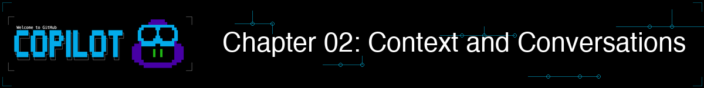
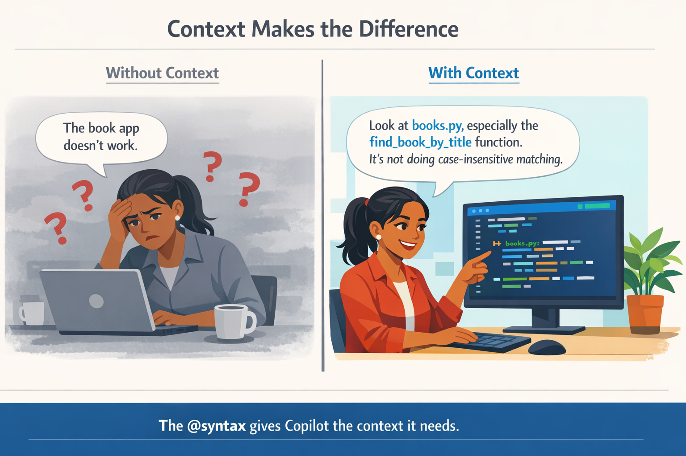
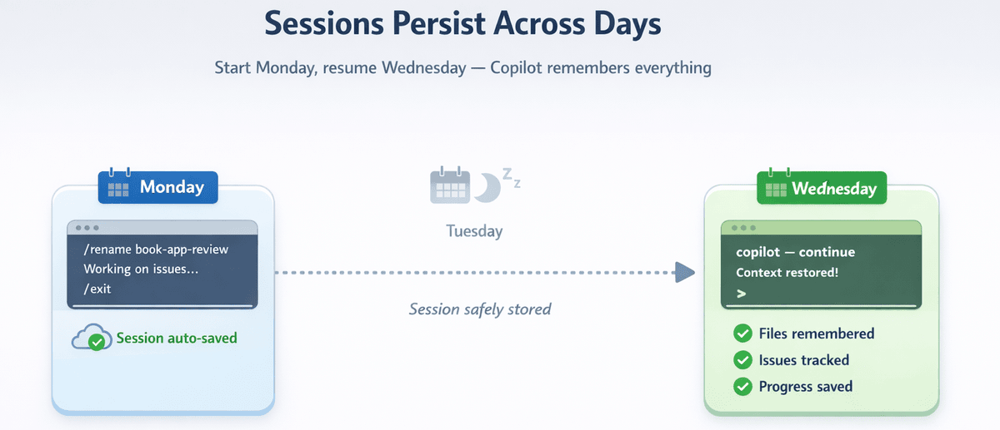
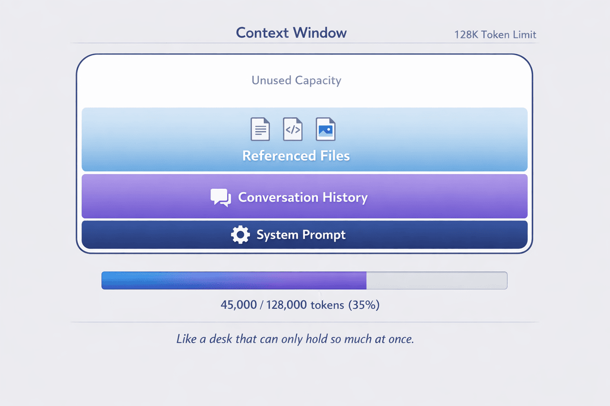

> **如果 AI 能看到你的整個程式碼庫，而不僅僅是每次一個檔案，會怎樣？**

在本章中，你將解鎖 GitHub Copilot CLI 的真正力量：內容。你將學習使用 `@` 語法來引用檔案和目錄，讓 Copilot CLI 對你的程式碼庫有深入的瞭解。你將發現如何在不同階段之間維持對話，在幾天後準確地從上次停下的地方恢復工作，並瞭解跨檔案分析如何捕捉單檔案審查完全遺漏的程式碼漏洞。

## 🎯 學習目標

到本章結束時，你將能夠：

- 使用 `@` 語法來引用檔案、目錄和圖片
- 使用 `--resume` 和 `--continue` 恢復先前的階段
- 瞭解 [內容視窗 (context window)](../GLOSSARY.md#context-window) 的運作方式
- 撰寫有效的多輪對話
- 管理多專案工作流程的目錄權限

> ⏱️ **預估時間**：~50 分鐘 (20 分鐘閱讀 + 30 分鐘動手實作)

---

## 🧩 現實世界的類比：與同事協作



*就像你的同事一樣，Copilot CLI 不是讀心者。提供更多資訊可以幫助人類和 Copilot 提供有針對性的支援！*

想像向同事解釋一個程式碼漏洞：

> **無內容**：「圖書應用程式無法運作。」

> **有內容**：「看看 `books.py`，特別是 `find_book_by_title` 函式。它沒有進行不區分大小寫的匹配。」

要向 Copilot CLI 提供內容，請使用 *`@` 語法* 將 Copilot CLI 指向特定檔案。

---

# 基本知識：基礎內容


本節涵蓋了有效運用內容所需的一切知識。請先掌握這些基礎。

---

## @ 語法

`@` 符號用於在提示中引用檔案和目錄。這是你告訴 Copilot CLI「看看這個檔案」的方式。

> 💡 **注意**：本課程中的所有範例都使用此儲存庫中包含的 `samples/` 資料夾，因此你可以直接嘗試每個指令。

### 現在就試試看 (無需設定)

你可以在電腦上的任何檔案嘗試這個：

```bash
copilot

# 指向你擁有的任何檔案
> Explain what @package.json does
> Summarize @README.md
> What's in @.gitignore and why?
```

> 💡 **手頭沒有專案？** 快速建立一個測試檔案：
> ```bash
> echo "def greet(name): return 'Hello ' + name" > test.py
> copilot
> > What does @test.py do?
> ```

### 基本 @ 模式

| 模式 | 作用 | 範例用法 |
|---------|--------------|-------------|
| `@file.py` | 引用單個檔案 | `Review @samples/book-app-project/books.py` |
| `@folder/` | 引用目錄中的所有檔案 | `Review @samples/book-app-project/` |
| `@file1.py @file2.py` | 引用多個檔案 | `Compare @samples/book-app-project/book_app.py @samples/book-app-project/books.py` |

### 引用單個檔案

```bash
copilot

> Explain what @samples/book-app-project/utils.py does
```

---

<details>
<summary>🎬 看看它的實際運作！</summary>


*展示輸出會有所不同。你的模型、工具和回應將與此處顯示的內容不同。*

</details>

---

### 引用多個檔案

```bash
copilot

> Compare @samples/book-app-project/book_app.py and @samples/book-app-project/books.py for consistency
```

### 引用整個目錄

```bash
copilot

> Review all files in @samples/book-app-project/ for error handling
```

---

## 跨檔案智慧

這是內容成為超能力的地方。單檔案分析很有用，而跨檔案分析則是變革性的。


### 展示：尋找跨越多個檔案的漏洞

```bash
copilot

> @samples/book-app-project/book_app.py @samples/book-app-project/books.py
>
> How do these files work together? What's the data flow?
```

> 💡 **進階選項**：對於以安全為中心的跨檔案分析，請嘗試 Python 安全範例：
> ```bash
> > @samples/buggy-code/python/user_service.py @samples/buggy-code/python/payment_processor.py
> > Find security vulnerabilities that span BOTH files
> ```

---

<details>
<summary>🎬 看看它的實際運作！</summary>


*展示輸出會有所不同。你的模型、工具和回應將與此處顯示的內容不同。*

</details>

---

**Copilot CLI 發現了什麼**：

```
跨模組分析
=====================

1. 資料流模式
   book_app.py 建立 BookCollection 實例並呼叫方法
   books.py 定義 BookCollection 類別並管理資料持續性

   流程：book_app.py (UI) → books.py (商業邏輯) → data.json (儲存)

2. 重複的顯示函式
   book_app.py:9-21    show_books() 函式
   utils.py:28-36      print_books() 函式

   影響：兩個幾乎完全相同的函式執行相同的工作。如果你更新其中一個
   (例如更改格式)，你必須記得更新另一個。

3. 不一致的錯誤處理
   book_app.py 處理來自年份轉換的 ValueError
   books.py 在發生錯誤時靜默返回 None/False

   模式：各模組之間沒有統一的錯誤處理方法
```

**為什麼這很重要**：單檔案審查會遺漏大局。只有跨檔案分析才能揭示：
- 應該整合的**重複程式碼**
- 顯示元件如何互動的**資料流模式**
- 影響可維護性的**架構問題**

---

### 展示：在 60 秒內理解程式碼庫


剛接觸一個專案？使用 Copilot CLI 快速瞭解它。

```bash
copilot

> @samples/book-app-project/
>
> In one paragraph, what does this app do and what are its biggest quality issues?
```

**你獲得的結果**：
```
這是一個命令列圖書收藏管理員，讓使用者新增、列出、移除和
搜尋儲存在 JSON 檔案中的書籍。最大的品質問題是：

1. 重複的顯示邏輯 - show_books() 和 print_books() 執行相同的工作
2. 不一致的錯誤處理 - 某些錯誤會拋出例外，其他則返回 False
3. 無輸入驗證 - 年份可以為 0，標題/作者接受空字串
4. 缺少測試 - 對於像 find_book_by_title 這樣的關鍵函式沒有測試覆蓋

優先修正：整合重複的顯示函式並新增輸入驗證。
```

**結果**：將需要一小時的程式碼閱讀壓縮成 10 秒鐘。你確切地知道該關注哪裡。

---

## 實際範例

### 範例 1：具備內容的程式碼審查

```bash
copilot

> @samples/book-app-project/books.py Review this file for potential bugs

# Copilot CLI 現在擁有完整的檔案內容，並能提供具體的回饋：
# 「第 49 行：區分大小寫的比較可能會遺漏書籍...」
# 「第 29 行：捕獲了 JSON 解碼錯誤，但未記錄資料損壞...」

> What about @samples/book-app-project/book_app.py?

# 現在審查 book_app.py，但仍然知道 books.py 的內容
```

### 範例 2：理解程式碼庫

```bash
copilot

> @samples/book-app-project/books.py What does this module do?

# Copilot CLI 讀取 books.py 並理解 BookCollection 類別

> @samples/book-app-project/ Give me an overview of the code structure

# Copilot CLI 掃描目錄並進行摘要

> How does the app save and load books?

# Copilot CLI 可以追溯它已經看過的程式碼
```

<details>
<summary>🎬 看看多輪對話的實際運作！</summary>


*展示輸出會有所不同。你的模型、工具和回應將與此處顯示的內容不同。*

</details>

### 範例 3：多檔案重構

```bash
copilot

> @samples/book-app-project/book_app.py @samples/book-app-project/utils.py
> I see duplicate display functions: show_books() and print_books(). Help me consolidate these.

# Copilot CLI 看到這兩個檔案，並能建議如何合併重複的程式碼
```

---

## 階段 (Session) 管理

階段會在你就執行工作時自動儲存。你可以恢復先前的階段，以便從上次停下的地方繼續。

### 階段自動儲存

每次對話都會自動儲存。只需正常退出：

```bash
copilot

> @samples/book-app-project/ Let's improve error handling across all modules

[... 執行一些工作 ...]

> /exit
```

### 恢復最近的階段

```bash
# 從上次停下的地方繼續
copilot --continue
```

### 恢復特定的階段

```bash
# 互動式地從階段清單中挑選
copilot --resume

# 或透過 ID 恢復特定階段
copilot --resume abc123
```

> 💡 **我該如何找到階段 ID？** 你不需要背誦它們。執行不帶 ID 的 `copilot --resume` 會顯示先前階段的互動式清單，包括它們的名稱、ID 以及上次活動的時間。只需挑選你想要的一個。
>
> **那多個終端機呢？** 每個終端機視窗都是其自己的階段，擁有自己的內容。如果你在三個終端機中開啟了 Copilot CLI，那就是三個獨立的階段。從任何終端機執行 `--resume` 都可以讓你瀏覽所有這些階段。`--continue` 旗標會抓取最近關閉的那個階段，無論它在哪個終端機中。
>
> **我可以在不重新啟動的情況下切換階段嗎？** 可以。在活動階段中使用 `/resume` 斜線指令：
> ```
> > /resume
> # 顯示要切換到的階段清單
> ```

### 組織你的階段

給階段有意義的名稱，以便日後尋找：

```bash
copilot

> /rename book-app-review
# 階段已重新命名以方便識別
```

### 檢查與管理內容

當您新增檔案與對話時，Copilot CLI 的 [context window](../GLOSSARY.md#context-window) 會逐漸填滿。以下幾個指令可以幫助您保持掌控：

```bash
copilot

> /context
已使用上下文：62k/200k 代幣（31%）

> /clear
# 放棄目前會話（不會保存歷史）並開始新的對話

> /new
# 結束目前會話（將其保存到歷史以便搜尋/恢復）並開始新的對話

> /rewind
# 開啟時間軸選擇器，允許你回到對話的較早時間點
```

> 💡 **何時使用 `/clear` 或 `/new`**：如果你正在檢視 books.py，想切換到討論 utils.py，請先執行 /new（如果你不需要會話歷史則執行 /clear）。否則舊主題的陳舊上下文可能會讓回應產生混淆。

> 💡 **犯錯或想嘗試不同做法？** 使用 `/rewind`（或連按兩次 Esc）開啟 **時間軸選擇器**，讓你回到對話中的任何較早時間點，而不僅限於最近的一次。當你走錯方向但不想完全重新開始時，這個功能很有用。

---

### 從上次停下的地方繼續



*當你退出時，階段會自動儲存。幾天後恢復，完整內容：檔案、問題和進度都會被記住。*

想像一下跨越多天的這個工作流程：

```bash
# 週一：開始圖書應用程式審查
copilot

> /rename book-app-review
> @samples/book-app-project/books.py
> Review and number all code quality issues

找到的品質問題：
1. 重複的顯示函式 (book_app.py & utils.py) - 中等 (MEDIUM)
2. 對空字串沒有輸入驗證 - 中等 (MEDIUM)
3. 年份可以為 0 或負數 - 低 (LOW)
4. 所有函式均未提供類型提示 (type hints) - 低 (LOW)
5. 缺少錯誤記錄 (error logging) - 低 (LOW)

> Fix issue #1 (duplicate functions)
# 正在處理修正案...

> /exit
```

```bash
# 週三：準確地從上次停下的地方恢復
copilot --continue

> What issues remain unfixed from our book app review?

來自我們 book-app-review 階段的剩餘問題：
2. 對空字串沒有輸入驗證 - 中等 (MEDIUM)
3. 年份可以為 0 或負數 - 低 (LOW)
4. 所有函式均未提供類型提示 (type hints) - 低 (LOW)
5. 缺少錯誤記錄 (error logging) - 低 (LOW)

問題 #1 (重複函式) 已在週一修正。

> Let's tackle issue #2 next
```

**是什麼讓這變強大**：幾天後，Copilot CLI 仍然記得：
- 你當時正在處理的確切檔案
- 編號的問題清單
- 哪些你已經處理過了
- 你的對話內容

不需要重新解釋。不需要重新閱讀檔案。只需繼續工作。

---

**🎉 你現在掌握了基礎知識！** `@` 語法、階段管理 (`--continue`/`--resume`/`/rename`) 和內容指令 (`/context`/`/clear`) 已足以讓你極具生產力。下方的內容都是可選的。當你準備好時再回來閱讀。

---

# 選修：深入探究


這些主題建立在上述基礎之上。**挑選你感興趣的內容，或直接跳至 [練習](#練習)。**

| 我想學習... | 跳至 |
|---|---|
| 通配符模式與進階階段指令 | [額外的 @ 模式與階段指令](#additional-patterns) |
| 在多個提示之間建立內容 | [內容感知對話](#context-aware-conversations) |
| 權杖 (Token) 限制與 `/compact` | [理解內容視窗](#understanding-context-windows) |
| 如何挑選合適的檔案來引用 | [選擇要引用的內容](#choosing-what-to-reference) |
| 分析螢幕截圖與模型圖 | [處理圖片](#working-with-images) |

<details>
<summary><strong>額外的 @ 模式與階段指令</strong></summary>
<a id="additional-patterns"></a>

### 額外的 @ 模式

對於進階使用者，Copilot CLI 支援通配符模式和圖片引用：

| 模式 | 作用 |
|---------|--------------|
| `@folder/*.py` | 資料夾中的所有 .py 檔案 |
| `@**/test_*.py` | 遞迴通配符：尋找各處的所有測試檔案 |
| `@image.png` | 用於 UI 審查的圖片檔案 |

```bash
copilot

> Find all TODO comments in @samples/book-app-project/**/*.py
```

### 檢視階段資訊

```bash
copilot

> /session
# 顯示目前階段細節與工作區摘要

> /usage
# 顯示階段指標與統計數據
```

### 分享你的階段

```bash
copilot

> /share file ./my-session.md
# 將階段匯出為 markdown 檔案

> /share gist
# 建立一個包含該階段的 GitHub gist

> /share html
# 將階段匯出為自包含且可互動的 HTML 檔案
# 方便與團隊成員分享整理過的階段報告或保存以供參考
```

</details>

<details>
<summary><strong>內容感知對話</strong></summary>
<a id="context-aware-conversations"></a>

### 內容感知對話

當你有相互建立的多輪對話時，奇蹟就會發生。

#### 範例：漸進式增強

```bash
copilot

> @samples/book-app-project/books.py Review the BookCollection class

Copilot CLI：「類別看起來功能正常，但我注意到：
1. 某些方法缺少類型提示
2. 對空標題/作者沒有驗證
3. 可以從更好的錯誤處理中獲益」

> Add type hints to all methods

Copilot CLI：「這是帶有完整類型提示的類別...」
[顯示類型化版本]

> Now improve error handling

Copilot CLI：「建立在類型化版本之上，這是改進後的錯誤處理...」
[新增驗證和適當的例外]

> Generate tests for this final version

Copilot CLI：「基於帶有類型和錯誤處理的類別...」
[產生全面的測試]
```

注意每個提示是如何建立在先前工作的基礎之上的。這就是內容的力量。

</details>

<details>
<summary><strong>理解內容視窗</strong></summary>
<a id="understanding-context-windows"></a>

### 理解內容視窗

你已經從基礎知識中瞭解了 `/context` 和 `/clear`。這裡更深入地介紹內容視窗的運作方式。

每個 AI 都有一個「內容視窗」，即它一次可以考慮的文字量。



*內容視窗就像一張桌子：它一次只能容納這麼多。檔案、對話紀錄和系統提示都會佔用空間。*

#### 達到限制時會發生什麼

```bash
copilot

> /context

內容使用情況：45,000 / 128,000 權杖 (35%)

# 當你新增更多檔案和對話時，這個數值會增長

> @large-codebase/

內容使用情況：120,000 / 128,000 權杖 (94%)

# 警告：接近內容限制

> @another-large-file.py

已達到內容限制。較舊的內容將被摘要。
```

#### `/compact` 指令

當你的內容快要滿了，但你不想失去對話時，`/compact` 會摘要你的歷史紀錄以釋放權杖：

```bash
copilot

> /compact
# 摘要對話紀錄，釋放內容空間
# 你的關鍵發現和決定會被保留
```

#### 內容效率提示

| 情境 | 動作 | 為什麼 |
|-----------|--------|-----|
| 開始新主題 | `/clear` | 移除不相關的內容 |
| 走錯方向 | `/rewind` | 回復到任一先前的點 |
| 長時間對話 | `/compact` | 摘要對話，釋放權杖 |
| 需要特定檔案 | `@file.py` 而非 `@folder/` | 只載入你需要的內容 |
| 達到限制 | `/new` 或 `/clear` | 建立新的或清空的內容視窗 |
| 多個主題 | 為每個主題使用 `/rename` | 容易恢復到正確的會話 |

#### 大型程式碼庫的最佳實作

1. **具體一點**：使用 `@samples/book-app-project/books.py` 而非 `@samples/book-app-project/`
2. **在主題間清除內容**：在切換焦點時使用 `/new` 或 `/clear`
3. **使用 `/compact`**：摘要對話以釋放內容空間
4. **使用多個階段**：每個功能或主題一個階段

</details>

<details>
<summary><strong>選擇要引用的內容</strong></summary>
<a id="choosing-what-to-reference"></a>

### 選擇要引用的內容

並非所有檔案在內容方面都是平等的。這裡是如何明智地選擇：

#### 檔案大小考量

| 檔案大小 | 近似 [權杖 (Tokens)](../GLOSSARY.md#token) | 策略 |
|-----------|-------------------|----------|
| 小 (<100 行) | ~500-1,500 權杖 | 自由引用 |
| 中 (100-500 行) | ~1,500-7,500 權杖 | 引用特定檔案 |
| 大 (500+ 行) | 7,500+ 權杖 | 有選擇性，使用特定檔案 |
| 非常大 (1000+ 行) | 15,000+ 權杖 | 考慮拆分或針對特定區段 |

**具體範例：**
- 圖書應用程式的 4 個 Python 檔案總計 ≈ 2,000-3,000 權杖
- 一個典型的 Python 模組 (200 行) ≈ 3,000 權杖
- 一個 Flask API 檔案 (400 行) ≈ 6,000 權杖
- 你的 package.json ≈ 200-500 權杖
- 一個簡短的提示 + 回應 ≈ 500-1,500 權杖

> 💡 **程式碼權杖快速估算：** 將程式碼行數乘以 ~15 即可得到近似的權杖數。請記住，這僅僅是估算。

#### 應包含與應排除的內容

**高價值** (包含這些)：
- 入口點 (`book_app.py`, `main.py`, `app.py`)
- 你正在詢問的特定檔案
- 你的目標檔案直接導入的檔案
- 設定檔 (`requirements.txt`, `pyproject.toml`)
- 資料模型或 dataclasses

**低價值** (考慮排除)：
- 產生的檔案 (編譯輸出、打包資產)
- Node 模組或供應商目錄 (vendor directories)
- 大型資料檔案或固定裝置 (fixtures)
- 與你的問題無關的檔案

#### 具體化光譜

```
不具體 ────────────────────────► 更具體
@samples/book-app-project/                      @samples/book-app-project/books.py:47-52
     │                                       │
     └─ 掃描所有內容                           └─ 只取你需要的
        (使用更多內容空間)                       (保留內容空間)
```

**何時寬泛** (`@samples/book-app-project/`)：
- 初始程式碼庫探索
- 尋找多個檔案中的模式
- 架構審查

**何時具體** (`@samples/book-app-project/books.py`)：
- 除錯特定問題
- 特定檔案的程式碼審查
- 詢問單個函式

#### 實際範例：分階段內容載入

```bash
copilot

# 步驟 1：從結構開始
> @package.json What frameworks does this project use?

# 步驟 2：根據答案縮小範圍
> @samples/book-app-project/ Show me the project structure

# 步驟 3：專注於重要的部分
> @samples/book-app-project/books.py Review the BookCollection class

# 步驟 4：僅根據需要新增相關檔案
> @samples/book-app-project/book_app.py @samples/book-app-project/books.py How does the CLI use the BookCollection?
```

這種分階段方法能保持內容集中且高效。

</details>

<details>
<summary><strong>處理圖片</strong></summary>
<a id="working-with-images"></a>

### 處理圖片

你可以使用 `@` 語法在對話中包含圖片，或只需 **從剪貼簿貼上** (Cmd+V / Ctrl+V)。Copilot CLI 可以分析螢幕截圖、模型圖和圖表，以協助進行 UI 除錯、設計實作和錯誤分析。

```bash
copilot

> @images/screenshot.png What is happening in this image?

> @images/mockup.png Write the HTML and CSS to match this design. Place it in a new file called index.html and put the CSS in styles.css.
```

> 📖 **瞭解更多**：查看 [額外的內容功能](../appendices/additional-context.md#working-with-images) 以獲取支援的格式、實際使用案例以及將圖片與程式碼結合的提示。

</details>

---

# 練習


是時候運用你的內容與階段管理技能了。

---

## ▶️ 親自嘗試

### 完整專案審查

課程包含你可以直接審查的範例檔案。啟動 Copilot 並執行下方的提示：

```bash
copilot

> @samples/book-app-project/ Give me a code quality review of this project

# Copilot CLI 將識別如下問題：
# - 重複的顯示函式
# - 缺少輸入驗證
# - 不一致的錯誤處理
```

> 💡 **想用你自己的檔案試試嗎？** 建立一個小型 Python 專案 (`mkdir -p my-project/src`)，新增一些 .py 檔案，然後使用 `@my-project/src/` 來審查它們。如果你願意，可以要求 Copilot 為你建立範例程式碼！

### 階段工作流程

```bash
copilot

> /rename book-app-review
> @samples/book-app-project/books.py Let's add input validation for empty titles

[Copilot CLI 建議驗證方法]

> Implement that fix
> Now consolidate the duplicate display functions in @samples/book-app-project/
> /exit

# 稍後 - 從你停下的地方恢復
copilot --continue

> Generate tests for the changes we made
```

---

完成展示後，嘗試這些變化：

1. **跨檔案挑戰**：分析 book_app.py 和 books.py 如何協作：
   ```bash
   copilot
   > @samples/book-app-project/book_app.py @samples/book-app-project/books.py
   > What's the relationship between these files? Are there any code smells?
   ```

2. **階段挑戰**：啟動一個階段，使用 `/rename my-first-session` 命名它，執行一些工作，使用 `/exit` 退出，然後執行 `copilot --continue`。它是否記得你當時正在做什麼？

3. **內容挑戰**：在階段中執行 `/context`。你正在使用多少權杖？嘗試 `/compact` 並再次檢查。(參閱「深入探究」中的 [理解內容視窗](#understanding-context-windows) 以瞭解更多關於 `/compact` 的資訊。)

**自我檢查**：當你能解釋為什麼 `@folder/` 比單獨開啟每個檔案更強大時，你就理解了內容。

---

## 📝 作業

### 主要挑戰：追蹤資料流

動手練習的重點是程式碼品質審查和輸入驗證。現在針對不同的任務練習相同的內容技能，追蹤資料如何流經應用程式：

1. 啟動互動階段：`copilot`
2. 同時引用 `books.py` 和 `book_app.py`：
   `@samples/book-app-project/books.py @samples/book-app-project/book_app.py Trace how a book goes from user input to being saved in data.json. What functions are involved at each step?`
3. 引入資料檔案以獲取額外內容：
   `@samples/book-app-project/data.json What happens if this JSON file is missing or corrupted? Which functions would fail?`
4. 請求跨檔案改進：
   `@samples/book-app-project/books.py @samples/book-app-project/utils.py Suggest a consistent error-handling strategy that works across both files.`
5. 重新命名階段：`/rename data-flow-analysis`
6. 使用 `/exit` 退出，然後使用 `copilot --continue` 恢復並詢問關於資料流的後續問題

**成功標準**：你可以跨多個檔案追蹤資料、恢復具名的階段，並獲得跨檔案建議。

<details>
<summary>💡 提示 (點擊展開)</summary>

**開始：**
```bash
cd /path/to/copilot-cli-for-beginners
copilot
> @samples/book-app-project/books.py @samples/book-app-project/book_app.py Trace how a book goes from user input to being saved in data.json.
> @samples/book-app-project/data.json What happens if this file is missing or corrupted?
> /rename data-flow-analysis
> /exit
```

然後恢復：`copilot --continue`

**實用的指令：**
- `@file.py` - 引用單個檔案
- `@folder/` - 引用資料夾中的所有檔案 (注意結尾的 `/`)
- `/context` - 檢查你使用了多少內容空間
- `/rename <name>` - 為你的階段命名以便輕鬆恢復

</details>

### 加分挑戰：內容限制

1. 使用 `@samples/book-app-project/` 一次引用所有圖書應用程式檔案
2. 針對不同檔案 (`books.py`, `utils.py`, `book_app.py`, `data.json`) 詢問幾個詳細問題
3. 執行 `/context` 查看使用情況。它填滿的速度有多快？
4. 練習使用 `/compact` 收回空間，然後繼續對話
5. 嘗試更具體地引用檔案 (例如，使用 `@samples/book-app-project/books.py` 而非整個資料夾)，並看看它如何影響內容使用情況

---

<details>
<summary>🔧 <strong>常見錯誤與疑難排解</strong> (點擊展開)</summary>

### 常見錯誤

| 錯誤 | 會發生什麼 | 修正 |
|---------|--------------|-----|
| 忘記在檔名前加 `@` | Copilot CLI 將 "books.py" 視為純文字 | 使用 `@samples/book-app-project/books.py` 引用檔案 |
| 期望階段自動持久存在 | 重新啟動 `copilot` 會失去所有先前的內容 | 使用 `--continue` (最後一個階段) 或 `--resume` (挑選階段) |
| 引用目前目錄以外的檔案 | 「Permission denied」或 「File not found」錯誤 | 使用 `/add-dir /path/to/directory` 授予存取權限 |
| 切換主題時未使用 `/clear` | 舊內容會干擾關於新主題的回應 | 在開始不同任務前執行 `/clear` |

### 疑難排解

**「File not found」錯誤** - 確保你位於正確的目錄：

```bash
pwd  # 檢查目前目錄
ls   # 列出檔案

# 然後啟動 copilot 並使用相對路徑
copilot

> Review @samples/book-app-project/books.py
```

**「Permission denied」** - 將目錄新增至你的允許清單：

```bash
copilot --add-dir /path/to/directory

# 或在階段中：
> /add-dir /path/to/directory
```

**內容空間填滿過快**：
- 檔案引用更具體一些
- 不同主題之間使用 `/clear`
- 將工作拆分到多個階段

</details>

---

# 摘要

## 🔑 重要關鍵

1. **`@` 語法** 為 Copilot CLI 提供關於檔案、目錄和圖片的內容
2. **多輪對話** 隨著內容的累積而相互建立
3. **階段自動儲存**：使用 `--continue` 或 `--resume` 從你停下的地方繼續
4. **內容視窗** 有限制：使用 `/context`、`/clear` 和 `/compact` 管理它們
5. **權限旗標** (`--add-dir`, `--allow-all`) 控制多目錄存取。請明智地使用它們！
6. **圖片引用** (`@screenshot.png`) 幫助視覺化地對 UI 問題進行除錯

> 📚 **官方文件**：[使用 Copilot CLI](https://docs.github.com/copilot/how-tos/copilot-cli/use-copilot-cli) 以獲取關於內容、階段和處理檔案的完整參考。

> 📋 **快速參考**：查看 [GitHub Copilot CLI 指令參考](https://docs.github.com/en/copilot/reference/cli-command-reference) 以獲取指令和快速鍵的完整清單。

---

## ➡️ 下一步

既然你已經可以向 Copilot CLI 提供內容，讓我們將其投入實際開發任務中。你剛剛學習的內容技術 (檔案引用、跨檔案分析和階段管理) 是下一章強大工作流程的基礎。

在 **[第 03 章：開發工作流程](../03-development-workflows/README.md)** 中，你將學習：

- 程式碼審查工作流程
- 重構模式
- 除錯協助
- 測試產生
- Git 整合

---

**[← 返回第 01 章](../01-setup-and-first-steps/README.md)** | **[繼續前往第 03 章 →](../03-development-workflows/README.md)**
