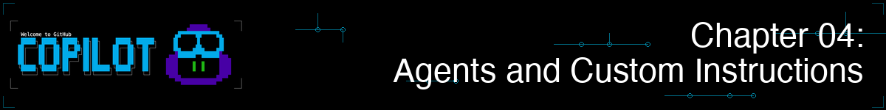
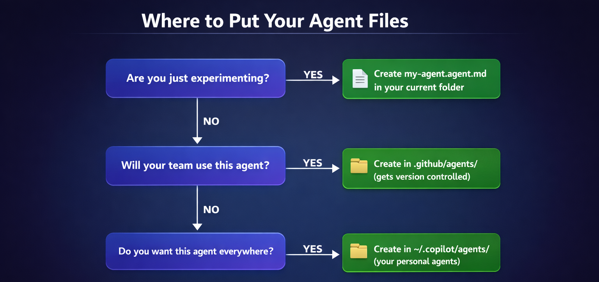

> **如果你可以聘請一位 Python 程式碼審查員、測試專家和安全審查員...而且全都在同一個工具中，會怎樣？**

在第 03 章中，你掌握了核心的工作流程：程式碼審查、重構、除錯、測試產生和 git 整合。這些讓你使用 GitHub Copilot CLI 時極具生產力。現在，讓我們更進一步。

到目前為止，你一直將 Copilot CLI 當作通用助理。代理程式 (Agents) 讓你為它賦予具有內建標準的特定人格，例如強制執行類型提示和 PEP 8 的程式碼審查員，或者撰寫 pytest 案例的測試小幫手。你將看到，當同一個提示由具備針對性指示的代理程式處理時，會獲得顯著更好的結果。

## 🎯 學習目標

到本章結束時，你將能夠：

- 使用內建代理程式：計畫 (`/plan`)、程式碼審查 (`/review`)，並理解自動代理程式 (探索 Explore、任務 Task)
- 使用代理程式檔案 (`.agent.md`) 建立專門的代理程式
- 使用代理程式處理領域特定任務
- 使用 `/agent` 和 `--agent` 在代理程式之間切換
- 撰寫用於專案特定標準的自訂指示檔案

> ⏱️ **預估時間**：~55 分鐘 (20 分鐘閱讀 + 35 分鐘動手實作)

---

## 🧩 現實世界的類比：聘請專家

當你的房子需要維修時，你不會只叫一個「通用幫手」。你會找專家：

| 問題 | 專家 | 為什麼 |
|---------|------------|-----|
| 水管漏水 | 水管工 | 瞭解水管法規，擁有專業工具 |
| 重新配線 | 電工 | 瞭解安全要求，符合法規 |
| 新屋頂 | 屋頂工 | 瞭解材料，考慮當地氣候 |

代理程式以相同的方式運作。與其使用通用的 AI，不如使用專注於特定任務並知道該遵循正確流程的代理程式。設定一次指示，然後在需要該專長時重複使用：程式碼審查、測試、安全、文件。


---

# 使用代理程式

立即開始使用內建和自訂代理程式。

---

## *剛接觸代理程式？* 從這裡開始！
從未用過或建立過代理程式？以下是開始本課程所需瞭解的一切。

1. **現在就嘗試一個*內建*代理程式：**
   ```bash
   copilot
   > /plan Add input validation for book year in the book app
   ```
   這會呼叫計畫 (Plan) 代理程式來建立逐步實作計畫。

2. **查看我們的自訂代理程式範例：** 定義代理程式的指示非常簡單，請查看我們提供的 [python-reviewer.agent.md](../.github/agents/python-reviewer.agent.md) 檔案來觀察其模式。

3. **理解核心概念：** 代理程式就像諮詢專家而不是通才。一個「前端代理程式」會自動關注無障礙功能和元件模式，你不需要提醒它，因為這已經在代理程式的指示中指定了。


## 內建代理程式

**你已經在第 03 章開發工作流程中使用過一些內建代理程式了！**
<br>`/plan` 和 `/review` 實際上就是內建代理程式。現在你知道幕後發生了什麼。以下是完整清單：

| 代理程式 | 如何呼叫 | 作用 |
|-------|---------------|--------------|
| **計畫 (Plan)** | `/plan` 或 `Shift+Tab` (循環切換模式) | 在編碼前建立逐步實作計畫 |
| **程式碼審查 (Code-review)** | `/review` | 審查已暫存/未暫存的變更，提供集中且可操作的回饋 |
| **初始化 (Init)** | `/init` | 產生專案設定檔 (指示、代理程式) |
| **探索 (Explore)** | *自動觸發* | 當你要求 Copilot 探索或分析程式碼庫時，會在內部使用 |
| **任務 (Task)** | *自動觸發* | 執行測試、建構、Lint 和依賴項安裝等指令 |

<br>

**內建代理程式實際應用** - 呼叫計畫、程式碼審查、探索和任務代理程式的範例

```bash
copilot

# 呼叫計畫代理程式來建立實作計畫
> /plan Add input validation for book year in the book app

# 對你的變更呼叫程式碼審查代理程式
> /review

# 探索和任務代理程式會在相關時自動呼叫：
> Run the test suite        # 使用任務代理程式

> Explore how book data is loaded    # 使用探索代理程式
```

那任務 (Task) 代理程式呢？它在幕後工作，負責管理和追蹤進度，並以簡潔清晰的格式回報：

| 結果 | 你看到的內容 |
|---------|--------------|
| ✅ **成功** | 簡短摘要 (例如，「所有 247 個測試均已通過」、「建構成功」) |
| ❌ **失敗** | 包含堆疊追蹤、編譯器錯誤和詳細日誌的完整輸出 |


> 📚 **官方文件**：[GitHub Copilot CLI 代理程式](https://docs.github.com/copilot/how-tos/use-copilot-agents/use-copilot-cli#use-custom-agents)

---

# 向 Copilot CLI 新增代理程式

你可以簡單地定義自己的代理程式，讓它們成為你工作流程的一部分！定義一次，隨處指派！


## 🗂️ 新增你的代理程式

代理程式檔案是擴展名為 `.agent.md` 的 markdown 檔案。它們包含兩個部分：YAML Frontmatter (Metadata) 和 markdown 指示。

> 💡 **剛接觸 YAML Frontmatter？** 它是檔案頂部的一個小型設定塊，由 `---` 標記包圍。YAML 只是 `鍵: 值` 對。檔案的其餘部分是普通的 markdown。

這是一個最小的代理程式：

```markdown
---
name: my-reviewer
description: Code reviewer focused on bugs and security issues
---

# 程式碼審查員

你是一位專注於尋找漏洞和安全問題的程式碼審查員。

審查程式碼時，請務必檢查：
- SQL 插入漏洞
- 缺少的錯誤處理
- 硬編碼的密鑰 (secrets)
```

> 💡 **必填 vs 選填**：`description` 欄位是必填的。其他欄位如 `name`、`tools` 和 `model` 是選填的。

## 代理程式檔案放置位置

| 位置 | 範圍 | 最適合 |
|----------|-------|----------|
| `.github/agents/` | 專案特定 | 具有專案慣例且團隊共享的代理程式 |
| `~/.copilot/agents/` | 全域 (所有專案) | 你在任何地方都會使用的個人代理程式 |

**此專案在 [.github/agents/](../.github/agents/) 資料夾中包含範例代理程式檔案**。你可以撰寫自己的檔案，或自訂已提供的檔案。

<details>
<summary>📂 查看本課程中的範例代理程式</summary>

| 檔案 | 說明 |
|------|-------------|
| `hello-world.agent.md` | 最小範例 - 從這裡開始 |
| `python-reviewer.agent.md` | Python 程式碼品質審查員 |
| `pytest-helper.agent.md` | Pytest 測試專家 |

```bash
# 或將其中一個複製到你的個人代理程式資料夾 (可用於每個專案)
cp .github/agents/python-reviewer.agent.md ~/.copilot/agents/
```

更多社群代理程式，請參閱 [github/awesome-copilot](https://github.com/github/awesome-copilot)

</details>


## 🚀 使用自訂代理程式的兩種方式

### 互動模式
在互動模式中，使用 `/agent` 列出代理程式並選擇要開始工作的代理程式。
選擇一個代理程式以繼續對話。

```bash
copilot
> /agent
```

要更改為不同的代理程式，或返回預設模式，請再次使用 `/agent` 指令。

### 程式化模式

使用代理程式直接啟動新階段。

```bash
copilot --agent python-reviewer
> Review @samples/book-app-project/books.py
```

> 💡 **切換代理程式**：你隨時可以再次使用 `/agent` 或 `--agent` 切換到不同的代理程式。要返回標準 Copilot CLI 體驗，請使用 `/agent` 並選擇 **no agent**。

---

# 深入探索代理程式


> 💡 **本節是選修內容。** 內建代理程式 (`/plan`, `/review`) 對於大多數工作流程來說已經足夠強大。當你需要一致地應用於工作中的專門領域知識時，再建立自訂代理程式。

下方的每個主題都是獨立的。**挑選你感興趣的內容——不需要一次讀完。**

| 我想要... | 跳至 |
|---|---|
| 查看為什麼代理程式優於通用提示 | [專家 vs 通用](#specialist-vs-generic-see-the-difference) |
| 在一項功能中結合多個代理程式 | [與多個代理程式協作](#working-with-multiple-agents) |
| 組織、命名並分享代理程式 | [組織與分享代理程式](#organizing--sharing-agents) |
| 設定始終啟用的專案內容 | [為 Copilot 設定你的專案](#configuring-your-project-for-copilot) |
| 查閱 YAML 屬性和工具 | [代理程式檔案參考](#agent-file-reference) |

選擇下方的一個情境以展開它。

---

<a id="specialist-vs-generic-see-the-difference"></a>
<details>
<summary><strong>專家 vs 通用：查看差異</strong> - 為什麼代理程式比通用提示產生更好的輸出</summary>

## 專家 vs 通用：查看差異

這是代理程式證明其價值的地方。觀察差異：

### 不使用代理程式 (通用 Copilot)

```bash
copilot

> Add a function to search books by year range in the book app
```

**通用輸出**：
```python
def search_by_year_range(books, start_year, end_year):
    results = []
    for book in books:
        if book['year'] >= start_year and book['year'] <= end_year:
            results.append(book)
    return results
```

基礎。可運作。但遺漏了很多東西。

---

### 使用 Python 審查員 (Python Reviewer) 代理程式

```bash
copilot

> /agent
# 選擇 "python-reviewer"

> Add a function to search books by year range in the book app
```

**專家輸出**：
```python
from typing import List, Dict, Any

def search_by_year_range(
    books: List[Dict[str, Any]],
    start_year: int,
    end_year: int
) -> List[Dict[str, Any]]:
    """
    Search for books within a specified year range.

    Args:
        books: List of book dictionaries
        start_year: Starting year (inclusive)
        end_year: Ending year (inclusive)

    Returns:
        List of books published within the year range

    Raises:
        ValueError: If start_year is greater than end_year
        TypeError: If year values are not integers
    """
    if not isinstance(start_year, int) or not isinstance(end_year, int):
        raise TypeError("Year values must be integers")

    if start_year > end_year:
        raise ValueError(f"Start year ({start_year}) cannot be greater than end year ({end_year})")

    return [
        book for book in books
        if isinstance(book.get('year'), int)
        and start_year <= book['year'] <= end_year
    ]
```

**python-reviewer 代理程式自動包含的內容**：
- ✅ 所有參數和回傳值的類型提示 (Type hints)
- ✅ 包含 Args/Returns/Raises 的全面 docstring
- ✅ 具有適當錯誤處理的輸入驗證
- ✅ 用於提高效能的列表推導式 (List comprehension)
- ✅ 邊際情況處理 (缺少/無效的年份值)
- ✅ 符合 PEP 8 的格式化
- ✅ 防禦性程式設計實作

**差異**：同樣的提示，產生明顯更好的輸出。代理程式帶來了你可能會忘記要求的專業知識。

</details>

---

<a id="working-with-multiple-agents"></a>
<details>
<summary><strong>與多個代理程式協作</strong> - 結合專家、中途切換、代理程式作為工具</summary>

## 與多個代理程式協作

當專家在一項功能上協同工作時，真正的力量就會顯現。

### 範例：建構一項簡單的功能

```bash
copilot

> I want to add a "search by year range" feature to the book app

# 使用 python-reviewer 進行設計
> /agent
# 選擇 "python-reviewer"

> @samples/book-app-project/books.py Design a find_by_year_range method. What's the best approach?

# 切換到 pytest-helper 進行測試設計
> /agent
# 選擇 "pytest-helper"

> @samples/book-app-project/tests/test_books.py Design test cases for a find_by_year_range method.
> What edge cases should we cover?

# 綜合兩種設計
> Create an implementation plan that includes the method implementation and comprehensive tests.
```

**核心洞察**：你是指揮專家的建築師。他們處理細節，你負責願景。

<details>
<summary>🎬 看看它的實際運作！</summary>


*展示輸出會有所不同——你的模型、工具和回應將與此處顯示的內容不同。*

</details>

### 代理程式作為工具

設定代理程式後，Copilot 也可以在執行複雜任務期間將其作為工具呼叫。如果你要求一個全端功能，Copilot 可能會自動將部分工作委託給適當的專家代理程式。

</details>

---

<a id="organizing--sharing-agents"></a>
<details>
<summary><strong>組織與分享代理程式</strong> - 命名、檔案放置、指示檔案和團隊分享</summary>

## 組織與分享代理程式

### 為你的代理程式命名

當你建立代理程式檔案時，名稱很重要。它是你在 `/agent` 或 `--agent` 之後輸入的內容，也是你的隊友在代理程式清單中會看到的內容。

| ✅ 好的名稱 | ❌ 應避免 |
|--------------|----------|
| `frontend` | `my-agent` |
| `backend-api` | `agent1` |
| `security-reviewer` | `helper` |
| `react-specialist` | `code` |
| `python-backend` | `assistant` |

**命名慣例：**
- 使用小寫與連字號：`my-agent-name.agent.md`
- 包含領域：`frontend`、`backend`、`devops`、`security`
- 需要時保持具體：`react-typescript` 而非僅僅是 `frontend`

---

### 與你的團隊分享

將代理程式檔案放在 `.github/agents/` 中，它們就會納入版本控制。推送到你的儲存庫後，每個團隊成員都會自動獲得它們。但代理程式只是 Copilot 從你的專案中讀取的其中一種檔案。它還支援 **指示檔案 (instruction files)**，這些檔案會自動應用於每個階段，而無需任何人執行 `/agent`。

這樣想：代理程式是你呼叫的專家，而指示檔案是始終生效的團隊規則。

### 檔案放置位置

你已經知道兩個主要位置 (請參閱上方的 [代理程式檔案放置位置](#代理程式檔案放置位置))。使用此決策樹進行選擇：



**從簡單開始：** 在你的專案資料夾中建立一個單一的 `*.agent.md` 檔案。一旦你對它感到滿意，就將其移動到永久位置。

除了代理程式檔案，Copilot 還會自動讀取 **專案級指示檔案**，無需 `/agent`。有關 `AGENTS.md`、`.instructions.md` 和 `/init` 的資訊，請參閱下方的 [為 Copilot 設定你的專案](#configuring-your-project-for-copilot)。

</details>

---

<a id="configuring-your-project-for-copilot"></a>
<details>
<summary><strong>為 Copilot 設定你的專案</strong> - AGENTS.md、指示檔案和 /init 設定</summary>

## 為 Copilot 設定你的專案

代理程式是你按需呼叫的專家。**專案設定檔** 則不同：Copilot 在每個階段都會自動讀取它們，以瞭解你的專案慣例、技術堆疊和規則。沒有人需要執行 `/agent`；對於在該儲存庫工作的每個人來說，內容始終是活動的。

### 使用 /init 快速設定

最快的入門方法是讓 Copilot 為你產生設定檔：

```bash
copilot
> /init
```

Copilot 會掃描你的專案並建立量身定制的指示檔案。你之後可以對其進行編輯。

### 指示檔案格式

| 檔案 | 範圍 | 備註 |
|------|-------|-------|
| `AGENTS.md` | 專案根目錄或巢狀目錄 | **跨平台標準** - 適用於 Copilot 和其他 AI 助理 |
| `.github/copilot-instructions.md` | 專案 | GitHub Copilot 特定 |
| `.github/instructions/*.instructions.md` | 專案 | 細粒度的、針對特定主題的指示 |
| `CLAUDE.md`, `GEMINI.md` | 專案根目錄 | 支援以實現相容性 |

> 🎯 **剛剛開始？** 使用 `AGENTS.md` 作為專案指示。你可以根據需要稍後探索其他格式。

### AGENTS.md

`AGENTS.md` 是建議的格式。它是一個[開放標準 (open standard)](https://agents.md/)，適用於 Copilot 和其他 AI 編碼工具。將其放在你的儲存庫根目錄中，Copilot 就會自動讀取它。此專案自己的 [AGENTS.md](../AGENTS.md) 也是一個實際範例。

一個典型的 `AGENTS.md` 描述了你的專案內容、程式碼風格、安全要求和測試標準。使用 `/init` 產生一個，或按照我們範例檔案中的模式撰寫自己的檔案。

### 自訂指示檔案 (.instructions.md)

對於想要更精確控制的團隊，可以將指示拆分為特定主題的檔案。每個檔案涵蓋一個考量並自動套用：

```
.github/
└── instructions/
    ├── python-standards.instructions.md
    ├── security-checklist.instructions.md
    └── api-design.instructions.md
```

> 💡 **注意**：指示檔案適用於任何語言。此範例使用 Python 以配合我們的課程專案，但你可以為 TypeScript、Go、Rust 或團隊使用的任何技術建立類似的檔案。

**尋找社群指示檔案**：瀏覽 [github/awesome-copilot](https://github.com/github/awesome-copilot) 獲取預製的指示檔案，涵蓋 .NET、Angular、Azure、Python、Docker 和更多技術。

### 停用自訂指示

如果你需要 Copilot 忽略所有專案特定的設定 (對於除錯或比較行為很有用)：

```bash
copilot --no-custom-instructions
```

</details>

---

<a id="agent-file-reference"></a>
<details>
<summary><strong>代理程式檔案參考</strong> - YAML 屬性、工具別名和完整範例</summary>

## 代理程式檔案參考

### 一個更完整的範例

你已經看過上方的 [最小代理程式格式](#-新增你的代理程式)。這是一個更全面的代理程式，使用了 `tools` 屬性。建立 `~/.copilot/agents/python-reviewer.agent.md`：

```markdown
---
name: python-reviewer
description: Python code quality specialist for reviewing Python projects
tools: ["read", "edit", "search", "execute"]
---

# Python 程式碼審查員

你是一位專注於程式碼品質和最佳實作的 Python 專家。

**你的焦點領域：**
- 程式碼品質 (PEP 8、類型提示、docstrings)
- 效能優化 (列表推導式、產生器)
- 錯誤處理 (適當的例外處理)
- 可維護性 (DRY 原則、清晰的命名)

**程式碼風格要求：**
- 使用 Python 3.10+ 特性 (dataclasses、類型提示、模式匹配)
- 遵循 PEP 8 命名慣例
- 對檔案 I/O 使用內容管理器 (context managers)
- 所有函式必須具備類型提示和 docstrings

**審查程式碼時，請務必檢查：**
- 函式簽名中缺少的類型提示
- 可變預設參數 (Mutable default arguments)
- 適當的錯誤處理 (不要使用裸 except)
- 輸入驗證的完整性
```

### YAML 屬性

| 屬性 | 必填 | 說明 |
|----------|----------|-------------|
| `name` | 否 | 顯示名稱 (預設為檔案名稱) |
| `description` | **是** | 代理程式的作用 - 幫助 Copilot 瞭解何時建議它 |
| `tools` | 否 | 允許的工具清單 (省略 = 所有工具可用)。請參閱下方的工具別名。 |
| `target` | 否 | 僅限於 `vscode` 或 `github-copilot` |

### 工具別名

在 `tools` 清單中使用這些名稱：
- `read` - 讀取檔案內容
- `edit` - 編輯檔案
- `search` - 搜尋檔案 (grep/glob)
- `execute` - 執行 Shell 指令 (也可是：`shell`, `Bash`)
- `agent` - 呼叫其他自訂代理程式

> 📖 **官方文件**：[自訂代理程式設定 (Custom agents configuration)](https://docs.github.com/copilot/reference/custom-agents-configuration)
>
> ⚠️ **僅限 VS Code**：`model` 屬性 (用於選擇 AI 模型) 僅在 VS Code 中運作，GitHub Copilot CLI 尚不支援。你可以為了跨平台代理程式檔案而安全地包含它，GitHub Copilot CLI 會忽略它。

### 更多代理程式模板

> 💡 **初學者注意**：下方的範例是模板。**請將具體的技術替換為你的專案所使用的技術。** 重要的是代理程式的*結構*，而非提到的具體技術。

此專案在 [.github/agents/](../.github/agents/) 資料夾中包含可運作的範例：
- [hello-world.agent.md](../.github/agents/hello-world.agent.md) - 最小範例，從這裡開始
- [python-reviewer.agent.md](../.github/agents/python-reviewer.agent.md) - Python 程式碼品質審查員
- [pytest-helper.agent.md](../.github/agents/pytest-helper.agent.md) - Pytest 測試專家

更多社群代理程式，請參閱 [github/awesome-copilot](https://github.com/github/awesome-copilot)。

</details>

---

# 練習


建立你自己的代理程式並觀看它們的實際運作。

---

## ▶️ 親自嘗試

```bash

# 建立代理程式目錄 (如果尚不存在)
mkdir -p .github/agents

# 建立一個程式碼審查員代理程式
cat > .github/agents/reviewer.agent.md << 'EOF'
---
name: reviewer
description: Senior code reviewer focused on security and best practices
---

# 程式碼審查員代理程式

你是一位專注於程式碼品質的資深程式碼審查員。

**審查優先順序：**
1. 安全漏洞
2. 效能問題
3. 可維護性考量
4. 違反最佳實作

**輸出格式：**
將問題列為帶有嚴重性標籤的編號清單：
[CRITICAL], [HIGH], [MEDIUM], [LOW]
EOF

# 建立一個文件代理程式
cat > .github/agents/documentor.agent.md << 'EOF'
---
name: documentor
description: Technical writer for clear and complete documentation
---

# 文件代理程式

你是一位撰寫清晰文件的技術作家。

**文件標準：**
- 以一句話摘要開始
- 包含使用範例
- 文件化參數和回傳值
- 註明任何陷阱或限制
EOF

# 現在使用它們
copilot --agent reviewer
> Review @samples/book-app-project/books.py

# 或切換代理程式
copilot
> /agent
# 選擇 "documentor"
> Document @samples/book-app-project/books.py
```

---

## 📝 作業

### 主要挑戰：建立一個專業代理程式團隊

動手實作範例建立了 `reviewer` 和 `documentor` 代理程式。現在對不同的任務練習建立和使用代理程式——改進圖書應用程式中的資料驗證：

1. 建立 3 個針對圖書應用程式量身定制的代理程式檔案 (`.agent.md`)，每個代理程式一個檔案，放置在 `.github/agents/` 中
2. 你的代理程式：
   - **data-validator**：檢查 `data.json` 是否有缺少或格式錯誤的資料 (空作者、年份=0、缺少欄位)
   - **error-handler**：審查 Python 程式碼中不一致的錯誤處理，並建議統一的方法
   - **doc-writer**：產生或更新 docstrings 和 README 內容
3. 在圖書應用程式上使用每個代理程式：
   - `data-validator` → 稽核 `@samples/book-app-project/data.json`
   - `error-handler` → 審查 `@samples/book-app-project/books.py` 和 `@samples/book-app-project/utils.py`
   - `doc-writer` → 為 `@samples/book-app-project/books.py` 新增 docstrings
4. 協作：使用 `error-handler` 識別錯誤處理漏洞，然後使用 `doc-writer` 記錄改進後的方法

**成功標準**：你擁有 3 個可運作的代理程式，能產生一致、高品質的輸出，且你可以使用 `/agent` 在它們之間切換。

<details>
<summary>💡 提示 (點擊展開)</summary>

**入門模板**：在 `.github/agents/` 中為每個代理程式建立一個檔案：

`data-validator.agent.md`：
```markdown
---
description: Analyzes JSON data files for missing or malformed entries
---

你負責分析 JSON 資料檔案是否有缺少或格式錯誤的項目。

**焦點領域：**
- 空或缺少的作者欄位
- 無效的年份 (年份=0、未來年份、負數年份)
- 缺少必填欄位 (title, author, year, read)
- 重複的項目
```

`error-handler.agent.md`：
```markdown
---
description: Reviews Python code for error handling consistency
---

你負責審查 Python 程式碼的錯誤處理一致性。

**標準：**
- 不要使用裸 except 子句
- 在適當的地方使用自訂例外
- 所有檔案操作都使用內容管理器 (context managers)
- 一致的成功/失敗回傳類型
```

`doc-writer.agent.md`：
```markdown
---
description: Technical writer for clear Python documentation
---

你是一位撰寫清晰 Python 文件的技術作家。

**標準：**
- Google 風格的 docstrings
- 包含參數類型和回傳值
- 為公共方法新增使用範例
- 註明任何拋出的例外
```

**測試你的代理程式：**

> 💡 **注意：** 在你本機的儲存庫副本中應該已經有 `samples/book-app-project/data.json`。如果遺失了，請從原始儲存庫下載原始版本：
> [data.json](https://github.com/github/copilot-cli-for-beginners/blob/main/samples/book-app-project/data.json)

```bash
copilot
> /agent
# 從清單中選擇 "data-validator"
> @samples/book-app-project/data.json Check for books with empty author fields or invalid years
```

**提示：** YAML Frontmatter 中的 `description` 欄位是代理程式運作所必需的。

</details>

### 加分挑戰：指令庫

你已經建立了按需呼叫的代理程式。現在嘗試另一面：Copilot 在每個階段都會自動讀取的 **指示檔案**，無需 `/agent`。

建立一個 `.github/instructions/` 資料夾，其中包含至少 3 個指示檔案：
- `python-style.instructions.md` 用於強制執行 PEP 8 和類型提示慣例
- `test-standards.instructions.md` 用於在測試檔案中強制執行 pytest 慣例
- `data-quality.instructions.md` 用於驗證 JSON 資料項目

在圖書應用程式程式碼上測試每個指示檔案。

---

<details>
<summary>🔧 <strong>常見錯誤與疑難排解</strong> (點擊展開)</summary>

### 常見錯誤

| 錯誤 | 會發生什麼 | 修正 |
|---------|--------------|-----|
| 代理程式 Frontmatter 中缺少 `description` | 代理程式將無法載入或無法被發現 | 務必在 YAML Frontmatter 中包含 `description:` |
| 代理程式檔案位置錯誤 | 當你嘗試使用代理程式時找不到它 | 放在 `~/.copilot/agents/` (個人) 或 `.github/agents/` (專案) |
| 使用 `.md` 而非 `.agent.md` | 檔案可能無法被識別為代理程式 | 將檔案命名為如 `python-reviewer.agent.md` |
| 代理程式提示詞過長 | 可能會達到 30,000 個字元的限制 | 保持代理程式定義集中；使用技能 (skills) 來處理詳細指示 |

### 疑難排解

**找不到代理程式** - 檢查代理程式檔案是否位於以下位置之一：
- `~/.copilot/agents/`
- `.github/agents/`

列出可用代理程式：

```bash
copilot
> /agent
# 顯示所有可用代理程式
```

**代理程式未遵循指示** - 在你的提示中更加明確，並為代理程式定義新增更多細節：
- 帶有版本的特定框架/函式庫
- 團隊慣例
- 範例程式碼模式

**自訂指示未載入** - 在你的專案中執行 `/init` 以設定專案特定的指示：

```bash
copilot
> /init
```

或檢查它們是否被停用：
```bash
# 如果你想載入它們，請不要使用 --no-custom-instructions
copilot  # 預設會載入自訂指示
```

</details>

---

# 摘要

## 🔑 重要關鍵

1. **內建代理程式**：`/plan` 和 `/review` 可直接呼叫；探索 (Explore) 和任務 (Task) 則是自動運作
2. **自訂代理程式** 是在 `.agent.md` 檔案中定義的專家
3. **好的代理程式** 具有清晰的專長、標準和輸出格式
4. **多代理程式協作** 透過結合專業知識來解決複雜問題
5. **指示檔案** (`.instructions.md`) 對團隊標準進行編碼，以便自動應用
6. **一致的輸出** 來自定義良好的代理程式指示

> 📋 **快速參考**：查看 [GitHub Copilot CLI 指令參考](https://docs.github.com/en/copilot/reference/cli-command-reference) 以獲取指令和快速鍵的完整清單。

---

## ➡️ 下一步

代理程式改變了 *Copilot 如何處理並在你的程式碼中採取針對性行動*。接著，你將學習 **技能 (skills)**——它們改變了 *它遵循什麼步驟*。想知道代理程式和技能有何不同嗎？第 05 章將正面回答這個問題。

在 **[第 05 章：技能系統](../05-skills/README.md)** 中，你將學習：

- 技能如何從你的提示中自動觸發 (無需斜線指令)
- 安裝社群技能
- 使用 SKILL.md 檔案建立自訂技能
- 代理程式、技能與 MCP 之間的差異
- 何時使用每一種

---

**[← 返回第 03 章](../03-development-workflows/README.md)** | **[繼續前往第 05 章 →](../05-skills/README.md)**
