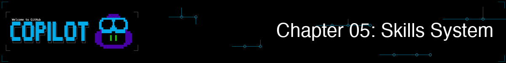
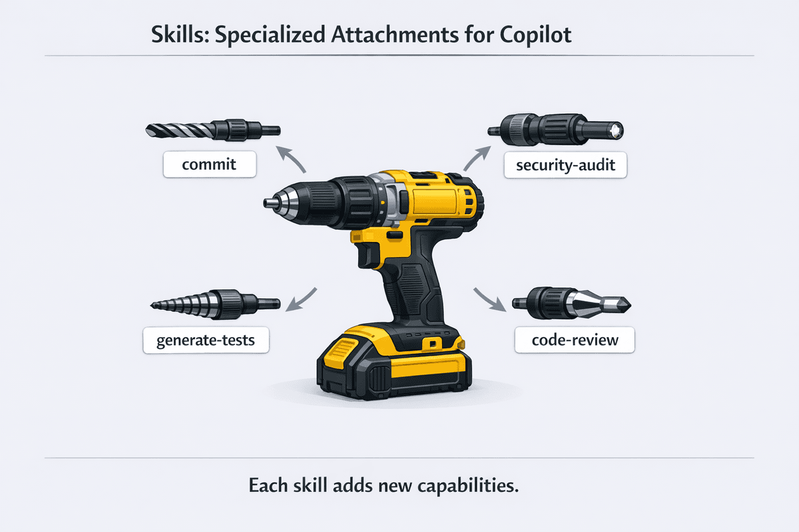

> **如果 Copilot 可以自動套用你團隊的最佳實作，而不需要你每次都解釋，會怎樣？**

在本章中，你將學習代理程式技能 (Agent Skills)：當與你的任務相關時，Copilot 會自動載入的指令資料夾。代理程式改變了 Copilot 的*思考方式*，而技能則教導 Copilot *完成任務的具體方法*。你將建立一個安全稽核技能，每當你詢問安全問題時 Copilot 都會套用它；建立團隊標準的審查標準，以確保一致的程式碼品質；並瞭解技能如何在 Copilot CLI、VS Code 和 GitHub Copilot 雲端代理程式中運作。


## 🎯 學習目標

到本章結束時，你將能夠：

- 瞭解代理程式技能的運作方式以及何時使用它們
- 使用 SKILL.md 檔案建立自訂技能
- 使用來自共享儲存庫的社群技能
- 瞭解何時使用技能、代理程式與 MCP

> ⏱️ **預估時間**：~55 分鐘 (20 分鐘閱讀 + 35 分鐘動手實作)

---

## 🧩 現實世界的類比：電動工具

通用電鑽很有用，但專門的配件使其功能強大。



技能以相同的方式運作。就像為不同的工作更換鑽頭一樣，你可以為不同的任務向 Copilot 新增技能：

| 技能配件 | 用途 |
|------------|---------|
| `commit` | 產生一致的提交訊息 |
| `security-audit` | 檢查 OWASP 漏洞 |
| `generate-tests` | 建立全面的 pytest 測試 |
| `code-checklist` | 套用團隊程式碼品質標準 |


*技能是擴展 Copilot 功能的專門配件*

---

# 技能如何運作


瞭解什麼是技能、為什麼它們很重要，以及它們與代理程式和 MCP 有何不同。

---

## *剛接觸技能？* 從這裡開始！

1. **查看目前有哪些可用技能：**
   ```bash
   copilot
   > /skills list
   ```

   這會顯示 Copilot 能找到的所有技能，包括隨 CLI 本身一起提供的 **內建技能**，以及來自你專案和個人資料夾的技能。

   > 💡 **內建技能**：Copilot CLI 隨附預先安裝的技能。例如，`customizing-copilot-cloud-agents-environment` 技能提供了一份用於自訂 Copilot 雲端代理程式環境的指南。你不需要建立或安裝任何東西即可使用。執行 `/skills list` 可查看可用技能。

2. **查看真實的技能檔案：** 查看我們提供的 [code-checklist SKILL.md](../.github/skills/code-checklist/SKILL.md) 以瞭解其模式。它只是 YAML Frontmatter 加上 markdown 指示。

3. **理解核心概念：** 技能是特定任務的指示，當你的提示符合技能說明時，Copilot 會*自動*載入這些指示。你不需要手動啟用它們，只需自然地提問即可。


## 理解技能

代理程式技能 (Agent Skills) 是包含指令、指令碼和資源的資料夾，Copilot 會在與你的任務**相關時自動載入**。Copilot 會讀取你的提示，檢查是否有任何匹配的技能，並自動套用相關指示。

```bash
copilot

> Check books.py against our quality checklist
# Copilot 偵測到這符合你的 "code-checklist" 技能
# 並自動套用其 Python 品質檢查表

> Generate tests for the BookCollection class
# Copilot 載入你的 "pytest-gen" 技能
# 並套用你偏好的測試結構

> What are the code quality issues in this file?
# Copilot 載入你的 "code-checklist" 技能
# 並根據你團隊的標準進行檢查
```

> 💡 **核心洞察**：技能是根據你的提示與技能說明的匹配程度**自動觸發**的。只需自然地提問，Copilot 就會在幕後套用相關技能。你也可以直接呼叫技能，這將在下一節中學習。

> 🧰 **即用型模板**：查看 [.github/skills](../.github/skills/) 資料夾以獲取你可以嘗試的簡單複製貼上技能。

### 直接斜線指令呼叫

雖然自動觸發是技能運作的主要方式，但你也可以使用技能名稱作為斜線指令**直接呼叫技能**：

```bash
> /generate-tests Create tests for the user authentication module

> /code-checklist Check books.py for code quality issues

> /security-audit Check the API endpoints for vulnerabilities
```

當你想確保使用特定技能時，這為你提供了明確的控制權。

> 📝 **技能 vs 代理程式呼叫**：不要混淆技能呼叫與代理程式呼叫：
> - **技能**：`/技能名稱 <提示>`，例如 `/code-checklist Check this file`
> - **代理程式**：`/agent` (從清單中選擇) 或 `copilot --agent <名稱>` (命令列)
>
> 如果你有名稱相同的技能和代理程式 (例如 "code-reviewer")，輸入 `/code-reviewer` 將呼叫**技能**而非代理程式。

### 我該如何知道使用了哪項技能？

你可以直接詢問 Copilot：

```bash
> What skills did you use for that response?

> What skills do you have available for security reviews?
```

### 技能 vs 代理程式 vs MCP

技能只是 GitHub Copilot 擴展性模型的一部分。以下是它們與代理程式和 MCP 伺服器的比較。

> *暫時不必擔心 MCP。我們將在 [第 06 章](../06-mcp-servers/) 中介紹它。這裡包含它是為了讓你瞭解技能在整體架構中的位置。*


| 功能 | 作用 | 何時使用 |
|---------|--------------|-------------|
| **代理程式 (Agents)** | 改變 AI 的思考方式 | 在許多任務中需要專門的專業知識 |
| **技能 (Skills)** | 提供特定任務的指示 | 具有詳細步驟的特定、可重複任務 |
| **MCP** | 連接外部服務 | 需要來自 API 的即時資料 |

使用代理程式獲得廣泛的專業知識，使用技能獲得特定任務指示，並使用 MCP 獲取外部資料。一個代理程式在對話中可以使用一個或多個技能。例如，當你要求代理程式檢查程式碼時，它可能會自動套用 `security-audit` 技能和 `code-checklist` 技能。

> 📚 **深入學習**：參閱官方的 [關於代理程式技能 (About Agent Skills)](https://docs.github.com/copilot/concepts/agents/about-agent-skills) 文件，以獲得關於技能格式和最佳實作的完整參考。

---

## 從手動提示到自動專業化

在深入研究如何建立技能之前，讓我們看看*為什麼*它們值得學習。一旦你看到一致性帶來的收益，「如何做」就會變得更有意義。

### 使用技能前：不一致的審查

每次進行程式碼審查時，你都可能會遺忘某些內容：

```bash
copilot

> Review this code for issues
# 通用審查 - 可能會遺漏你團隊特定的考量
```

或者你每次都要寫長長的提示：

```bash
> Review this code checking for bare except clauses, missing type hints,
> mutable default arguments, missing context managers for file I/O,
> functions over 50 lines, print statements in production code...
```

耗時：**30 秒以上**的輸入時間。一致性：**取決於記憶力**。

### 使用技能後：自動最佳實作

安裝了 `code-checklist` 技能後，只需自然地提問：

```bash
copilot

> Check the book collection code for quality issues
```

**幕後發生了什麼**：
1. Copilot 在你的提示中看到「code quality」和「issues」
2. 檢查技能說明，發現你的 `code-checklist` 技能匹配
3. 自動載入你團隊的品質檢查表
4. 無需你列出項目即可套用所有檢查


*只需自然提問。Copilot 會將你的提示與正確的技能匹配並自動套用。*

**輸出**：
```
## Code Checklist: books.py

### 程式碼品質
- [通過] 所有函式都有類型提示
- [通過] 沒有裸 except 子句
- [通過] 沒有可變預設參數
- [通過] 檔案 I/O 使用了內容管理器 (Context managers)
- [通過] 函式少於 50 行
- [通過] 變數和函式名稱遵循 PEP 8

### 輸入驗證
- [失敗] 使用者輸入未經驗證 - add_book() 接受任何年份值
- [失敗] 邊際情況未完全處理 - 標題/作者接受空字串
- [通過] 錯誤訊息清晰且有幫助

### 測試
- [失敗] 未找到對應的 pytest 測試

### 摘要
3 個項目在合併前需要注意
```

**差異**：你團隊的標準會自動套用，每次都是如此，無需逐字輸入。

---

<details>
<summary>🎬 看看它的實際運作！</summary>


*展示輸出會有所不同。你的模型、工具和回應將與此處顯示的內容不同。*

</details>

---

## 大規模的一致性：團隊 PR 審查技能

想像你的團隊有一份 10 點 PR 檢查表。如果沒有技能，每位開發者都必須記住這 10 個要點，而總有人會漏掉其中一項。有了 `pr-review` 技能，整個團隊都能獲得一致的審查：

```bash
copilot

> Can you review this PR?
```

Copilot 會自動載入你團隊的 `pr-review` 技能並檢查所有 10 個要點：

```
PR Review: feature/user-auth

## 安全性 ✅
- 無硬編碼的密鑰
- 具備輸入驗證
- 沒有裸 except 子句

## 程式碼品質 ⚠️
- [警告] 第 45 行有 print 語句 - 合併前請移除
- [警告] 第 78 行的 TODO 缺少 issue 引用
- [警告] 公共函式缺少類型提示

## 測試 ✅
- 已新增新測試
- 已覆蓋邊際情況

## 文件 ❌
- [失敗] CHANGELOG 中未記錄破壞性變更
- [失敗] API 變更需要更新 OpenAPI 規範
```

**力量所在**：每位團隊成員都會自動套用相同的標準。新員工不需要背誦檢查表，因為技能會處理這一切。

---

# 建立自訂技能


從 SKILL.md 檔案建立你自己的技能。

---

## 技能位置

技能儲存在 `.github/skills/` (專案特定) 或 `~/.copilot/skills/` (使用者級別) 中。

### Copilot 如何尋找技能

Copilot 會自動掃描這些位置以尋找技能：

| 位置 | 範圍 |
|----------|-------|
| `.github/skills/` | 專案特定 (透過 git 與團隊共享) |
| `~/.copilot/skills/` | 使用者特定 (你的個人技能) |

### 技能結構

每個技能都位於其自己的資料夾中，並包含一個 `SKILL.md` 檔案。你可以選擇包含指令碼、範例或其他資源：

```
.github/skills/
└── my-skill/
    ├── SKILL.md           # 必填：技能定義與指示
    ├── examples/          # 選填：Copilot 可以引用的範例檔案
    │   └── sample.py
    └── scripts/           # 選填：技能可以使用的指令碼
        └── validate.sh
```

> 💡 **提示**：目錄名稱應與 SKILL.md Frontmatter 中的 `name` 相匹配 (小寫且帶有連字號)。

### SKILL.md 格式

技能使用帶有 YAML Frontmatter 的簡單 markdown 格式：

```markdown
---
name: code-checklist
description: Comprehensive code quality checklist with security, performance, and maintainability checks
license: MIT
---

# 程式碼檢查表

檢查程式碼時，請查看：

## 安全性
- SQL 插入漏洞
- XSS 漏洞
- 身份驗證/授權問題
- 敏感資料洩漏

## 效能
- N+1 查詢問題 (對每個項目執行一次查詢，而不是對所有項目執行一次查詢)
- 不必要的循環或計算
- 記憶體洩漏
- 阻塞操作 (Blocking operations)

## 可維護性
- 函式長度 (標記 > 50 行的函式)
- 程式碼重複
- 缺少錯誤處理
- 命名不清晰

## 輸出格式
將問題列為帶有嚴重程度的編號清單：
- [CRITICAL] - 合併前必須修正
- [HIGH] - 合併前應該修正
- [MEDIUM] - 應盡快處理
- [LOW] - 最好能改進
```

**YAML 屬性：**

| 屬性 | 必填 | 說明 |
|----------|----------|-------------|
| `name` | **是** | 唯一識別碼 (小寫，空格用連字號替代) |
| `description` | **是** | 技能的作用以及 Copilot 何時應使用它 |
| `license` | 否 | 適用於此技能的授權條款 |

> 📖 **官方文件**：[關於代理程式技能 (About Agent Skills)](https://docs.github.com/copilot/concepts/agents/about-agent-skills)

### 建立你的第一個技能

讓我們建立一個檢查 OWASP Top 10 漏洞的安全稽核技能：

```bash
# 建立技能目錄
mkdir -p .github/skills/security-audit

# 建立 SKILL.md 檔案
cat > .github/skills/security-audit/SKILL.md << 'EOF'
---
name: security-audit
description: Security-focused code review checking OWASP (Open Web Application Security Project) Top 10 vulnerabilities
---

# 安全稽核

執行安全稽核，檢查：

## 插入 (Injection) 漏洞
- SQL 插入 (查詢中的字串串接)
- 指令插入 (未經清理的 Shell 指令)
- LDAP 插入
- XPath 插入

## 身份驗證問題
- 硬編碼的憑證
- 弱密碼要求
- 缺少費率限制 (Rate limiting)
- 工作階段管理缺陷

## 敏感資料
- 明文密碼
- 程式碼中的 API 金鑰
- 記錄敏感資訊
- 缺少加密

## 存取控制
- 缺少授權檢查
- 不安全的直接物件引用
- 路徑遍歷 (Path traversal) 漏洞

## 輸出
對於找到的每個問題，請提供：
1. 檔案與行號
2. 漏洞類型
3. 嚴重程度 (CRITICAL/HIGH/MEDIUM/LOW)
4. 建議的修復方法
EOF

# 測試你的技能 (技能會根據你的提示自動載入)
copilot

> @samples/book-app-project/ Check this code for security vulnerabilities
# Copilot 偵測到 "security vulnerabilities" 符合你的技能
# 並自動套用其 OWASP 檢查表
```

**預期輸出** (你的結果會有所不同)：

```
安全稽核：book-app-project

[HIGH] 硬編碼的檔案路徑 (book_app.py, 第 12 行)
  檔案路徑是硬編碼的而非可配置的
  修正：使用環境變數或設定檔

[MEDIUM] 缺少輸入驗證 (book_app.py, 第 34 行)
  使用者輸入未經清理即直接傳遞給函式
  修正：在處理前新增輸入驗證

✅ 未發現 SQL 插入
✅ 未發現硬編碼憑證
```

---

## 撰寫良好的技能說明

SKILL.md 中的 `description` 欄位至關重要！它是 Copilot 決定是否載入你的技能的依據：

```markdown
---
name: security-audit
description: Use for security reviews, vulnerability scanning,
  checking for SQL injection, XSS, authentication issues,
  OWASP Top 10 vulnerabilities, and security best practices
---
```

> 💡 **提示**：包含與你自然提問方式相匹配的關鍵字。如果你說「security review」，請在說明中包含「security review」。

### 將技能與代理程式結合

技能與代理程式協同工作。代理程式提供專業知識，技能提供具體指示：

```bash
# 以 code-reviewer 代理程式開始
copilot --agent code-reviewer

> Check the book app for quality issues
# code-reviewer 代理程式的專業知識結合了
# 你的 code-checklist 技能中的檢查表
```

---

# 管理與分享技能

發現已安裝的技能、尋找社群技能並分享你自己的技能。


---

## 使用 `/skills` 指令管理技能

使用 `/skills` 指令來管理你安裝的技能：

| 指令 | 作用 |
|---------|--------------|
| `/skills list` | 顯示所有已安裝的技能 |
| `/skills info <名稱>` | 取得特定技能的詳細資訊 |
| `/skills add <名稱>` | 啟用一項技能 (來自儲存庫或市集) |
| `/skills remove <名稱>` | 停用或解除安裝一項技能 |
| `/skills reload` | 編輯 SKILL.md 檔案後重新載入技能 |

> 💡 **記住**：你不需要為每個提示「啟用」技能。一旦安裝，技能會在你的提示符合其說明時**自動觸發**。這些指令是用於管理哪些技能可用，而不是用於使用它們。

### 範例：檢視你的技能

```bash
copilot

> /skills list

可用技能：
- security-audit: Security-focused code review checking OWASP Top 10
- generate-tests: Generate comprehensive unit tests with edge cases
- code-checklist: Team code quality checklist
...

> /skills info security-audit

技能：security-audit
來源：專案
位置：.github/skills/security-audit/SKILL.md
說明：Security-focused code review checking OWASP Top 10 vulnerabilities
```

---

<details>
<summary>看看它的實際運作！</summary>


*展示輸出會有所不同。你的模型、工具和回應將與此處顯示的內容不同。*

</details>

---

### 何時使用 `/skills reload`

建立或編輯技能的 SKILL.md 檔案後，執行 `/skills reload` 以在不重新啟動 Copilot 的情況下取用變更：

```bash
# 編輯你的技能檔案
# 接著在 Copilot 中：
> /skills reload
技能已成功重新載入。
```

> 💡 **值得瞭解**：在使用 `/compact` 摘要對話紀錄後，技能仍然有效。壓縮後不需要重新載入。

---

## 尋找並使用社群技能

### 使用外掛程式 (Plugins) 安裝技能

> 💡 **什麼是外掛程式？** 外掛程式是可安裝的套件，可以將技能、代理程式和 MCP 伺服器設定組合在一起。將它們想像成 Copilot CLI 的「應用程式商店」擴充功能。

`/plugin` 指令讓你可以瀏覽並安裝這些套件：

```bash
copilot

> /plugin list
# 顯示已安裝的外掛程式

> /plugin marketplace
# 瀏覽可用的外掛程式

> /plugin install <外掛程式名稱>
# 從市集安裝外掛程式
```

外掛程式可以將多種功能捆綁在一起——一個外掛程式可能包含協同工作的相關技能、代理程式和 MCP 伺服器設定。

### 社群技能儲存庫

預製技能也可以從社群儲存庫中獲得：

- **[Awesome Copilot](https://github.com/github/awesome-copilot)** - 官方 GitHub Copilot 資源，包括技能文件和範例

### 手動安裝社群技能

如果你在 GitHub 儲存庫中找到一項技能，請將其資料夾複製到你的技能目錄中：

```bash
# 複製 awesome-copilot 儲存庫
git clone https://github.com/github/awesome-copilot.git /tmp/awesome-copilot

# 將特定技能複製到你的專案
cp -r /tmp/awesome-copilot/skills/code-checklist .github/skills/

# 或供所有專案個人使用
cp -r /tmp/awesome-copilot/skills/code-checklist ~/.copilot/skills/
```

> ⚠️ **安裝前請審查**：在將技能複製到你的專案之前，請務必閱讀技能的 `SKILL.md`。技能控制著 Copilot 的行為，惡意技能可能會指示它執行有害指令或以意外方式修改程式碼。

---

# 練習


透過建立和測試你自己的技能來應用你學到的知識。

---

## ▶️ 親自嘗試

### 建立更多技能

這裡還有兩項展示不同模式的技能。遵循上方「建立你的第一個技能」中的相同 `mkdir` + `cat` 工作流程，或將技能複製並貼上到適當位置。更多範例可在 [.github/skills](../.github/skills) 中找到。

### pytest 測試產生技能

一項確保整個程式碼庫中具備一致的 pytest 結構的技能：

```bash
mkdir -p .github/skills/pytest-gen

cat > .github/skills/pytest-gen/SKILL.md << 'EOF'
---
name: pytest-gen
description: Generate comprehensive pytest tests with fixtures and edge cases
---

# pytest 測試產生

產生包含以下內容的 pytest 測試：

## 測試結構
- 使用 pytest 慣例 (test_ 前綴)
- 儘可能每個測試一個斷言 (assertion)
- 使用描述預期行為的清晰測試名稱
- 使用 fixtures 進行設定 (setup) 與清理 (teardown)

## 覆蓋範圍
- 成功路徑情境
- 邊際情況：None、空字串、空列表
- 邊界值 (Boundary values)
- 使用 pytest.raises() 的錯誤情境

## Fixtures
- 使用 @pytest.fixture 處理可重用的測試資料
- 使用 tmpdir/tmp_path 進行檔案操作
- 使用 pytest-mock 模擬外部依賴項

## 輸出
提供包含正確導入 (imports) 的完整、可執行的測試檔案。
EOF
```

### 團隊 PR 審查技能

一項在團隊中強制執行一致的 PR 審查標準的技能：

```bash
mkdir -p .github/skills/pr-review

cat > .github/skills/pr-review/SKILL.md << 'EOF'
---
name: pr-review
description: Team-standard PR review checklist
---

# PR 審查

根據團隊標準審查程式碼變更：

## 安全性檢查表
- [ ] 無硬編碼的密鑰或 API 金鑰
- [ ] 所有使用者資料均有輸入驗證
- [ ] 沒有裸 except 子句
- [ ] 日誌中無敏感資料

## 程式碼品質
- [ ] 函式少於 50 行
- [ ] 正式環境程式碼中無 print 語句
- [ ] 公共函式具備類型提示
- [ ] 檔案 I/O 使用內容管理器
- [ ] 沒有缺少 issue 引用的 TODO

## 測試
- [ ] 新程式碼有測試
- [ ] 覆蓋邊際情況
- [ ] 沒有無解釋的跳過測試

## 文件
- [ ] API 變更已記錄
- [ ] 註明破壞性變更 (Breaking changes)
- [ ] 若有需要，已更新 README

## 輸出格式
將結果提供為：
- ✅ PASS：看起來不錯的項目
- ⚠️ WARN：可以改進的項目
- ❌ FAIL：合併前必須修正的項目
EOF
```

### 更進一步

1. **技能建立挑戰**：建立一個執行 3 點檢查表的 `quick-review` 技能：
   - 裸 except 子句
   - 缺少的類型提示
   - 不清晰的變數名稱

   透過詢問：「Do a quick review of books.py」來測試它。

2. **技能比較**：計時手動撰寫詳細安全審查提示所需的時間。然後只需詢問「Check for security issues in this file」並讓你的 `security-audit` 技能自動載入。這項技能節省了多少時間？

3. **團隊技能挑戰**：思考你團隊的程式碼審查檢查表。你能將其編碼為技能嗎？寫下該技能應始終檢查的 3 件事。

**自我檢查**：當你能解釋為什麼 `description` 欄位很重要時 (它是 Copilot 決定是否載入你的技能的依據)，你就理解了技能。

---

## 📝 作業

### 主要挑戰：建立圖書摘要技能

上方的範例建立了 `pytest-gen` 和 `pr-review` 技能。現在練習建立一種完全不同類型的技能：用於從資料產生格式化輸出的技能。

1. 列出你目前的技能：執行 Copilot 並傳遞 `/skills list` 給它。你也可以使用 `ls .github/skills/` 查看專案技能，或使用 `ls ~/.copilot/skills/` 查看個人技能。
2. 在 `.github/skills/book-summary/SKILL.md` 建立一個 `book-summary` 技能，用於產生圖書收藏的格式化 markdown 摘要。
3. 你的技能應具備：
   - 清晰的名稱和說明 (說明對於匹配至關重要！)
   - 特定的格式化規則 (例如，包含標題、作者、年份、閱讀狀態的 markdown 表格)
   - 輸出慣例 (例如，對閱讀狀態使用 ✅/❌，按年份排序)
4. 測試技能：`@samples/book-app-project/data.json Summarize the books in this collection`
5. 透過檢查 `/skills list` 驗證技能是否自動觸發。
6. 嘗試使用 `/book-summary Summarize the books in this collection` 直接呼叫它。

**成功標準**：你擁有一個可運作的 `book-summary` 技能，當你詢問有關圖書收藏的問題時，Copilot 會自動套用該技能。

<details>
<summary>💡 提示 (點擊展開)</summary>

**入門模板**：建立 `.github/skills/book-summary/SKILL.md`：

```markdown
---
name: book-summary
description: Generate a formatted markdown summary of a book collection
---

# 圖書摘要產生器

按照以下規則產生圖書收藏的摘要：

1. 輸出一份 markdown 表格，包含列：Title, Author, Year, Status
2. 已讀書籍使用 ✅，未讀書籍使用 ❌
3. 按年份排序 (最舊的優先)
4. 在底部包含總計數
5. 標記任何資料問題 (缺少作者、無效年份)

範例：
| Title | Author | Year | Status |
|-------|--------|------|--------|
| 1984 | George Orwell | 1949 | ✅ |
| Dune | Frank Herbert | 1965 | ❌ |

**總計：2 本書 (1 本已讀，1 本未讀)**
```

**測試它：**
```bash
copilot
> @samples/book-app-project/data.json Summarize the books in this collection
# 該技能應根據說明匹配自動觸發
```

**如果它沒有觸發：** 嘗試 `/skills reload` 然後再次詢問。

</details>

### 加分挑戰：提交訊息技能

1. 建立一個 `commit-message` 技能，以一致的格式產生慣例提交訊息。
2. 透過暫存一個變更並詢問：「Generate a commit message for my staged changes」來測試它。
3. 文件化你的技能，並在 GitHub 上使用 `copilot-skill` 主題分享它。

---

<details>
<summary>🔧 <strong>常見錯誤與疑難排解</strong> (點擊展開)</summary>

### 常見錯誤

| 錯誤 | 會發生什麼 | 修正 |
|---------|--------------|-----|
| 將檔案命名為 `SKILL.md` 以外的名稱 | 技能將無法被識別 | 檔案必須精確命名為 `SKILL.md` |
| `description` 欄位過於模糊 | 技能永遠不會自動載入 | 說明是主要的發現機制。使用特定的觸發詞 |
| Frontmatter 中缺少 `name` 或 `description` | 技能載入失敗 | 在 YAML Frontmatter 中新增這兩個欄位 |
| 資料夾位置錯誤 | 找不到技能 | 使用 `.github/skills/技能名稱/` (專案) 或 `~/.copilot/skills/技能名稱/` (個人) |

### 疑難排解

**技能未被使用** - 如果 Copilot 未按預期使用你的技能：

1. **檢查說明**：它是否與你的提問方式匹配？
   ```markdown
   # 不好：太過模糊
   description: Reviews code

   # 好：包含觸發詞
   description: Use for code reviews, checking code quality,
     finding bugs, security issues, and best practice violations
   ```

2. **驗證檔案位置**：
   ```bash
   # 專案技能
   ls .github/skills/

   # 使用者技能
   ls ~/.copilot/skills/
   ```

3. **檢查 SKILL.md 格式**：Frontmatter 是必須的：
   ```markdown
   ---
   name: skill-name
   description: What the skill does and when to use it
   ---

   # 這裡寫指示
   ```

**技能未出現** - 驗證資料夾結構：
```
.github/skills/
└── my-skill/           # 資料夾名稱
    └── SKILL.md        # 必須精確為 SKILL.md (區分大小寫)
```

建立或編輯技能後執行 `/skills reload`，以確保取用變更。

**測試技能是否載入** - 直接詢問 Copilot：
```bash
> What skills do you have available for checking code quality?
# Copilot 會說明它找到的相關技能
```

**我該如何知道我的技能是否真的在起作用？**

1. **檢查輸出格式**：如果你的技能指定了輸出格式 (例如 `[CRITICAL]` 標籤)，請在回應中尋找該格式
2. **直接詢問**：獲得回應後，詢問「Did you use any skills for that?」
3. **對比測試**：使用 `--no-custom-instructions` 嘗試相同的提示，看看有何不同：
   ```bash
   # 使用技能
   copilot --allow-all -p "Review @file.py for security issues"

   # 不使用技能 (基準對照)
   copilot --allow-all -p "Review @file.py for security issues" --no-custom-instructions
   ```
4. **檢查特定檢查項**：如果你的技能包含特定檢查項 (例如「超過 50 行的函式」)，看看這些是否出現在輸出中

</details>

---

# 摘要

## 🔑 重要關鍵

1. **技能是自動的**：當你的提示與技能說明匹配時，Copilot 會載入它們
2. **直接呼叫**：你也可以使用 `/技能名稱` 作為斜線指令直接呼叫技能
3. **SKILL.md 格式**：YAML Frontmatter (名稱、說明、選填的授權) 加上 markdown 指示
4. **位置很重要**：`.github/skills/` 用於專案/團隊共享，`~/.copilot/skills/` 用於個人使用
5. **說明是關鍵**：撰寫與你自然提問方式相匹配的說明

> 📋 **快速參考**：查看 [GitHub Copilot CLI 指令參考](https://docs.github.com/en/copilot/reference/cli-command-reference) 以獲取指令和快速鍵的完整清單。

---

## ➡️ 下一步

技能透過自動載入的指示擴展了 Copilot 的功能。但是，連接到外部服務呢？這就是 MCP 派上用場的地方。

在 **[第 06 章：MCP 伺服器](../06-mcp-servers/README.md)** 中，你將學習：

- 什麼是 MCP (模型內容協定，Model Context Protocol)
- 連接到 GitHub、檔案系統和文件服務
- 設定 MCP 伺服器
- 多伺服器工作流程

---

**[← 返回第 04 章](../04-agents-custom-instructions/README.md)** | **[繼續前往第 06 章 →](../06-mcp-servers/README.md)**
