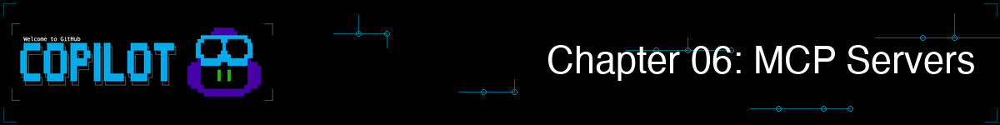
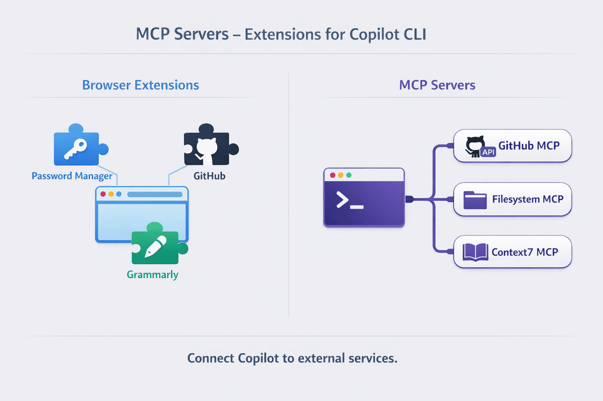
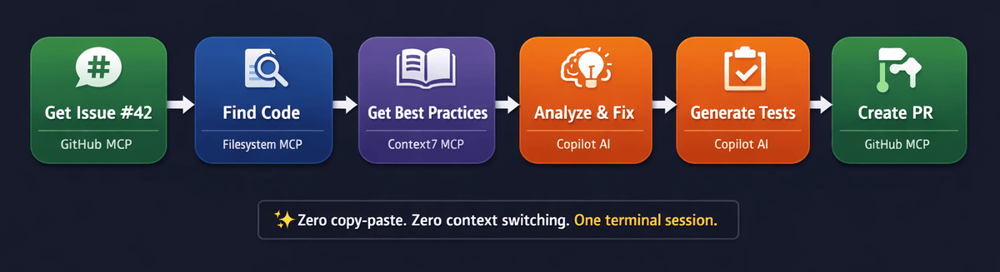

> **如果 Copilot 可以讀取你的 GitHub issue、檢查你的資料庫，並建立 PR... 而且全都在終端機中完成，會怎樣？**

到目前為止，Copilot 只能處理你直接提供的內容：你使用 `@` 引用的檔案、對話紀錄，以及它自己的訓練資料。但如果它可以主動查看你的 GitHub 儲存庫、瀏覽你的專案檔案，或者查閱某個函式庫的最新文件呢？

這就是 MCP (模型內容協定，Model Context Protocol) 的作用。它是一種將 Copilot 連接到外部服務的方法，使其能夠存取真實、即時的資料。Copilot 連接的每個服務都被稱為一個「MCP 伺服器」。在本章中，你將設定一些此類連接，並觀察它們如何讓 Copilot 變得異常實用。

> 💡 **已經熟悉 MCP 了嗎？** [跳至快速入門](#-使用內建的-github-mcp) 以確認其運作正常並開始設定伺服器。

## 🎯 學習目標

到本章結束時，你將能夠：

- 理解什麼是 MCP 以及它為什麼重要
- 使用 `/mcp` 指令管理 MCP 伺服器
- 為 GitHub、檔案系統和文件設定 MCP 伺服器
- 在圖書應用程式專案中使用由 MCP 驅動的工作流程
- 瞭解何時以及如何建構自訂 MCP 伺服器 (選修)

> ⏱️ **預估時間**：~50 分鐘 (15 分鐘閱讀 + 35 分鐘動手實作)

---

## 🧩 現實世界的類比：瀏覽器擴充功能



將 MCP 伺服器想像成瀏覽器擴充功能。瀏覽器本身可以顯示網頁，但擴充功能將其連接到額外的服務：

| 瀏覽器擴充功能 | 連接對象 | MCP 等效項 |
|-------------------|---------------------|----------------|
| 密碼管理員 | 你的密碼庫 | **GitHub MCP** → 你的儲存庫、issue、PR |
| Grammarly | 寫作分析服務 | **Context7 MCP** → 函式庫文件 |
| 檔案管理員 | 雲端儲存 | **Filesystem MCP** → 本機專案檔案 |

沒有擴充功能，你的瀏覽器仍然有用，但有了它們，它就成了一個強大的工具。MCP 伺服器對 Copilot 也是如此。它們將其連接到真實、即時的資料源，使其能夠讀取你的 GitHub issue、探索你的檔案系統、獲取最新的文件等等。

***MCP 伺服器將 Copilot 與外部世界連接起來：GitHub、儲存庫、文件等***

> 💡 **核心洞察**：沒有 MCP，Copilot 只能看到你明確使用 `@` 分享的檔案。有了 MCP，它可以主動探索你的專案、檢查你的 GitHub 儲存庫並查閱文件，且一切都是自動完成的。

---


# 快速入門：30 秒瞭解 MCP

## 使用內建的 GitHub MCP 伺服器
在設定任何內容之前，讓我們現在就看看 MCP 的實際運作。
GitHub MCP 伺服器已預設包含。試試這個：

```bash
copilot
> List the recent commits in this repository
```

如果 Copilot 回傳了真實的提交 (commit) 資料，那麼你剛剛就看到了 MCP 的實際運作。那是 GitHub MCP 伺服器代表你與 GitHub 進行通訊。但 GitHub 只是*一個*伺服器。本章將展示如何新增更多伺服器 (檔案系統存取、最新文件等)，以便 Copilot 可以做更多事情。

---

## `/mcp show` 指令

使用 `/mcp show` 查看已設定哪些 MCP 伺服器以及它們是否已啟用：

```bash
copilot

> /mcp show

MCP 伺服器：
✓ github (已啟用) - GitHub 整合
✓ filesystem (已啟用) - 檔案系統存取
```

> 💡 **只看到 GitHub 伺服器？** 這是正常的！如果你尚未新增任何額外的 MCP 伺服器，GitHub 是唯一列出的。你將在下一節中新增更多。

> 📚 **想查看所有 MCP 管理指令嗎？** 你可以在聊天中使用 `/mcp` 斜線指令來管理伺服器，或直接在終端機使用 `copilot mcp`。請參閱本章末的 [完整指令參考](#-additional-mcp-commands)。

<details>
<summary>🎬 看看它的實際運作！</summary>


*展示輸出會有所不同。你的模型、工具和回應將與此處顯示的內容不同。*

</details>

---

## MCP 帶來了什麼改變？

以下是 MCP 在實踐中帶來的差異：

**不使用 MCP：**
```bash
> What's in GitHub issue #42?

「我沒有 GitHub 的存取權限。你需要複製並貼上 issue 的內容。」
```

**使用 MCP：**
```bash
> What's in GitHub issue #42 of this repository?

Issue #42: 登入在特殊字元時失敗
狀態：開啟 (Open)
標籤：bug, priority-high
說明：使用者回報包含...的密碼...
```

MCP 讓 Copilot 意識到你實際的開發環境。

> 📚 **官方文件**：[關於 MCP](https://docs.github.com/copilot/concepts/context/mcp) 深入瞭解 MCP 如何與 GitHub Copilot 協作。

---

# 設定 MCP 伺服器


現在你已經看到 MCP 的實際運作，接下來我們來設定額外的伺服器。你可以用兩種方式新增伺服器：**從內建註冊中心安裝**（最簡單 — 在 CLI 中有引導式設定）或**手動編輯設定檔**（較具彈性）。如果不確定要選哪一種，從註冊中心開始。

---

## 從註冊中心安裝 MCP 伺服器

CLI 內建一個 MCP 伺服器註冊中心，讓你發現並安裝熱門伺服器，並提供引導式設定 — 無需編輯 JSON。

```bash
copilot

> /mcp search
```

Copilot 會開啟互動式選擇器，顯示可用的伺服器。選擇後，CLI 會引導你完成任何必要的設定（如 API 金鑰、路徑等），並自動將它新增到你的設定檔中。

> 💡 **為何使用註冊中心？** 這是最簡單的入門方式 — 你不需要知道 npm 套件名稱、命令參數或 JSON 結構，CLI 會替你處理這些細節。

---

## MCP 設定檔

MCP 伺服器的設定放在 `~/.copilot/mcp-config.json`（使用者層級，適用於所有專案）或 `.mcp.json`（專案層級，放在專案根目錄）。如果你剛剛使用了 `/mcp search`，CLI 會已為你建立或更新此檔案，但了解其格式以便自訂仍然很有用。

> ⚠️ **注意**：`.vscode/mcp.json` 不再被支援為 MCP 設定來源。如果你有既有的 `.vscode/mcp.json`，請將它移轉到專案根目錄的 `.mcp.json`。CLI 偵測到舊的設定檔時會顯示移轉提示。

```json
{
  "mcpServers": {
    "server-name": {
      "type": "local",
      "command": "npx",
      "args": ["@package/server-name"],
      "tools": ["*"]
    }
  }
}
```

*大多數 MCP 伺服器以 npm 套件形式發佈，並透過 `npx` 指令執行。*

<details>
<summary>💡 <strong>剛接觸 JSON？</strong> 點擊此處瞭解每個欄位的含義</summary>

| 欄位 | 含義 |
|-------|---------------|
| `"mcpServers"` | 包含你所有 MCP 伺服器設定的容器 |
| `"server-name"` | 你選擇的名稱 (例如 "github", "filesystem") |
| `"type": "local"` | 伺服器在你的機器上執行 |
| `"command": "npx"` | 要執行的程式 (npx 執行 npm 套件) |
| `"args": [...]` | 傳遞給指令的參數 |
| `"tools": ["*"]` | 允許此伺服器中的所有工具 |

**重要的 JSON 規則：**
- 字串使用雙引號 `"` (不要使用單引號)
- 最後一個項目後不要有結尾逗號
- 檔案必須是有效的 JSON (如果不確定，請使用 [JSON 驗證器](https://jsonlint.com/))

</details>

---

## 新增 MCP 伺服器

GitHub MCP 伺服器是內建的，不需要設定。下方是你可以新增的其他伺服器。**挑選你感興趣的內容，或按順序完成。**

| 我想要... | 跳至 |
|---|---|
| 讓 Copilot 瀏覽我的專案檔案 | [檔案系統 (Filesystem) 伺服器](#filesystem-server) |
| 獲取最新的函式庫文件 | [Context7 伺服器](#context7-server-documentation) |
| 探索選修擴充 (自訂伺服器、web_fetch) | [超越基礎知識](#beyond-the-basics) |

<details>
<summary><strong>檔案系統 (Filesystem) 伺服器</strong> - 讓 Copilot 探索你的專案檔案</summary>
<a id="filesystem-server"></a>

### 檔案系統 (Filesystem) 伺服器

```json
{
  "mcpServers": {
    "filesystem": {
      "type": "local",
      "command": "npx",
      "args": ["-y", "@modelcontextprotocol/server-filesystem", "."],
      "tools": ["*"]
    }
  }
}
```

> 💡 **`.` 路徑**：`.` 表示「目前目錄」。Copilot 可以存取相對於你啟動它的位置的檔案。在 Codespace 中，這是你的工作區根目錄。如果你願意，也可以使用絕對路徑，例如 `/workspaces/copilot-cli-for-beginners`。

將此新增至你的 `~/.copilot/mcp-config.json` 並重啟 Copilot。

</details>

<details>
<summary><strong>Context7 伺服器</strong> - 獲取最新的函式庫文件</summary>
<a id="context7-server-documentation"></a>

### Context7 伺服器 (文件)

Context7 讓 Copilot 可以存取熱門框架和函式庫的最新文件。Copilot 不再依賴可能過時的訓練資料，而是獲取實際的當前文件。

```json
{
  "mcpServers": {
    "context7": {
      "type": "local",
      "command": "npx",
      "args": ["-y", "@upstash/context7-mcp"],
      "tools": ["*"]
    }
  }
}
```

- ✅ **不需要 API 金鑰**
- ✅ **不需要帳號**
- ✅ **你的程式碼保留在本地**

將此新增至你的 `~/.copilot/mcp-config.json` 並重啟 Copilot。

</details>

<details>
<summary><strong>超越基礎知識</strong> - 自訂伺服器與網路存取 (選修)</summary>
<a id="beyond-the-basics"></a>

這些是當你熟悉上方的核心伺服器後的選修擴充內容。

### Microsoft Learn MCP 伺服器

你目前看過的所有 MCP 伺服器 (filesystem, Context7) 都在你的機器上本機執行。但 MCP 伺服器也可以遠端執行，這意味著你只需將 Copilot CLI 指向一個 URL，其餘部分由它處理。不需要 `npx` 或 `python`，不需要本地進程，也不需要安裝依賴項。

[Microsoft Learn MCP 伺服器](https://github.com/microsoftdocs/mcp) 就是一個很好的例子。它讓 Copilot CLI 可以直接存取 Microsoft 官方文件 (Azure、Microsoft Foundry 和其他 AI 主題、.NET、Microsoft 365 等等)，因此它可以搜尋文件、獲取完整頁面並尋找官方程式碼範例，而不是依賴模型的訓練資料。

- ✅ **不需要 API 金鑰**
- ✅ **不需要帳號**
- ✅ **不需要本地安裝**

**使用 `/plugin install` 快速安裝：**

與其手動編輯 JSON 設定檔，你可以使用一個指令安裝它：

```bash
copilot

> /plugin install microsoftdocs/mcp
```

這會自動新增伺服器及其關聯的代理程式技能。安裝的技能包括：

- **microsoft-docs**：概念、教學和事實查閱
- **microsoft-code-reference**：API 查閱、程式碼範例和疑難排解
- **microsoft-skill-creator**：用於產生關於 Microsoft 技術的自訂技能的元技能 (meta-skill)

**用法：**
```bash
copilot

> What's the recommended way to deploy a Python app to Azure App Service? Search Microsoft Learn.
```

📚 瞭解更多：[Microsoft Learn MCP 伺服器概觀](https://learn.microsoft.com/training/support/mcp-get-started)

### 使用 `web_fetch` 進行網路存取

Copilot CLI 包含一個內建的 `web_fetch` 工具，可以從任何 URL 獲取內容。這對於在不離開終端機的情況下引入 README、API 文件或發佈說明非常有用。不需要 MCP 伺服器。

你可以透過 `~/.copilot/config.json` (一般 Copilot 設定) 控制哪些 URL 可存取，這與 `~/.copilot/mcp-config.json` (MCP 伺服器定義) 是分開的。

```json
{
  "permissions": {
    "allowedUrls": [
      "https://api.github.com/**",
      "https://docs.github.com/**",
      "https://*.npmjs.org/**"
    ],
    "blockedUrls": [
      "http://**"
    ]
  }
}
```

**用法：**
```bash
copilot

> Fetch and summarize the README from https://github.com/facebook/react
```

### 建構自訂 MCP 伺服器

想要將 Copilot 連接到你自己的 API、資料庫或內部工具嗎？你可以用 Python 建構自訂 MCP 伺服器。由於預建的伺服器 (GitHub, filesystem, Context7) 已涵蓋大多數使用案例，因此這完全是選修的。

📖 參閱 [自訂 MCP 伺服器指南](mcp-custom-server.md) 以圖書應用程式為例進行完整逐步引導。

📚 更多背景知識，請參閱 [MCP 初學者課程](https://github.com/microsoft/mcp-for-beginners)。

</details>

<a id="complete-configuration-file"></a>

### 完整的設定檔

這是一個包含檔案系統和 Context7 伺服器的完整 `mcp-config.json`：

> 💡 **注意**：GitHub MCP 是內建的。你不需要將其新增到設定檔中。

```json
{
  "mcpServers": {
    "filesystem": {
      "type": "local",
      "command": "npx",
      "args": ["-y", "@modelcontextprotocol/server-filesystem", "."],
      "tools": ["*"]
    },
    "context7": {
      "type": "local",
      "command": "npx",
      "args": ["-y", "@upstash/context7-mcp"],
      "tools": ["*"]
    }
  }
}
```

將此儲存為 `~/.copilot/mcp-config.json` 以供全域存取，或將其儲存為專案根目錄下的 `.mcp.json` 以用於專案特定的設定。

---

# 使用 MCP 伺服器

既然你已經設定好了 MCP 伺服器，讓我們看看它們能做什麼。


---

## 伺服器用法範例

**挑選一個伺服器進行探索，或按順序完成。**

| 我想嘗試... | 跳至 |
|---|---|
| GitHub 儲存庫、issue 和 PR | [GitHub 伺服器](#github-server-built-in) |
| 瀏覽專案檔案 | [檔案系統伺服器用法](#filesystem-server-usage) |
| 查閱函式庫文件 | [Context7 伺服器用法](#context7-server-usage) |
| 自訂伺服器、Microsoft Learn MCP 與 web_fetch 用法 | [超越基礎知識用法](#beyond-the-basics-usage) |

<details>
<summary><strong>GitHub 伺服器 (內建)</strong> - 存取儲存庫、issue、PR 等</summary>
<a id="github-server-built-in"></a>

### GitHub 伺服器 (內建)

GitHub MCP 伺服器是**內建的**。如果你已登入 Copilot (這是在初始設定期間完成的)，它就已經可以運作了。不需要任何設定！

> 💡 **無法運作？** 執行 `/login` 向 GitHub 重新驗證。

<details>
<summary><strong>在開發容器中的驗證</strong></summary>

- **GitHub Codespaces** (建議)：驗證是自動的。`gh` CLI 會繼承你的 Codespace 權杖。不需要任何操作。
- **本地開發容器 (Docker)**：容器啟動後執行 `gh auth login`，然後重啟 Copilot。

**驗證疑難排解：**
```bash
# 檢查你是否已驗證
gh auth status

# 如果沒有，請登入
gh auth login

# 驗證 GitHub MCP 已連接
copilot
> /mcp show
```

</details>

| 功能 | 範例 |
|---------|----------|
| **儲存庫資訊** | 檢視提交 (commits)、分支 (branches)、貢獻者 |
| **Issues** | 列出、建立、搜尋及評論 issue |
| **提取請求 (Pull requests)** | 檢視 PR、差異 (diffs)、建立 PR、檢查狀態 |
| **程式碼搜尋** | 跨儲存庫搜尋程式碼 |
| **Actions** | 查詢工作流程執行情況和狀態 |

```bash
copilot

# 查看此儲存庫中的近期活動
> List the last 5 commits in this repository

近期提交：
1. abc1234 - 更新第 05 章技能範例 (2 天前)
2. def5678 - 新增圖書應用程式測試固定裝置 (3 天前)
3. ghi9012 - 修正第 03 章 README 中的錯字 (4 天前)
...

# 探索儲存庫結構
> What branches exist in this repository?

分支：
- main (預設)
- chapter6 (目前)

# 在儲存庫中搜尋程式碼模式
> Search this repository for files that import pytest

找到 1 個檔案：
- samples/book-app-project/tests/test_books.py
```

> 💡 **正在你自己的分叉 (fork) 上工作？** 如果你分叉了此課程儲存庫，你還可以嘗試寫入操作，例如建立 issue 和提取請求。我們將在下方的練習中練習這些。

> ⚠️ **看不到結果？** GitHub MCP 在儲存庫的遠端 (在 github.com 上) 執行，而不僅僅是本地檔案。請確保你的儲存庫有一個遠端：執行 `git remote -v` 進行檢查。

</details>

<details>
<summary><strong>檔案系統 (Filesystem) 伺服器</strong> - 瀏覽並分析專案檔案</summary>
<a id="filesystem-server-usage"></a>

### 檔案系統 (Filesystem) 伺服器

設定完成後，檔案系統 MCP 會提供 Copilot 可以自動使用的工具：

```bash
copilot

> How many Python files are in the book-app-project directory?

在 samples/book-app-project/ 中找到 3 個 Python 檔案：
- book_app.py
- books.py
- utils.py

> What's the total size of the data.json file?

samples/book-app-project/data.json: 2.4 KB

> Find all functions that don't have type hints in the book app

找到 2 個沒有類型提示的函式：
- samples/book-app-project/utils.py:10 - get_user_choice()
- samples/book-app-project/utils.py:14 - get_book_details()
```

</details>

<details>
<summary><strong>Context7 伺服器</strong> - 查閱函式庫文件</summary>
<a id="context7-server-usage"></a>

### Context7 伺服器

```bash
copilot

> What are the best practices for using pytest fixtures?

來自 pytest 文件：

Fixtures - 使用 fixture 為測試提供固定的基準：

    import pytest

    @pytest.fixture
    def sample_books():
        return [
            {"title": "1984", "author": "George Orwell", "year": 1949},
            {"title": "Dune", "author": "Frank Herbert", "year": 1965},
        ]

    def test_find_by_author(sample_books):
        # fixture 會自動作為參數傳遞
        results = [b for b in sample_books if "Orwell" in b["author"]]
        assert len(results) == 1

最佳實作：
- 使用 fixture 而非 setup/teardown 方法
- 對暫存檔案使用 tmp_path fixture
- 使用 monkeypatch 修改環境
- 適當地限定 fixture 範圍 (函式、類別、模組、階段)

> How can I apply this to the book app's test file?

# Copilot 現在瞭解了官方的 pytest 模式
# 並能將其套用到 samples/book-app-project/tests/test_books.py
```

</details>

<details>
<summary><strong>超越基礎知識</strong> - 自訂伺服器與 web_fetch 用法</summary>
<a id="beyond-the-basics-usage"></a>

### 超越基礎知識

**自訂 MCP 伺服器**：如果你根據 [自訂 MCP 伺服器指南](mcp-custom-server.md) 建構了圖書查閱伺服器，你可以直接查詢你的圖書收藏：

```bash
copilot

> Look up information about "1984" using the book lookup server. Search for books by George Orwell
```

**Microsoft Learn MCP**：如果你安裝了 [Microsoft Learn MCP 伺服器](#microsoft-learn-mcp-server)，你可以直接查閱 Microsoft 官方文件：

```bash
copilot

> How do I configure managed identity for an Azure Function? Search Microsoft Learn.
```

**Web Fetch**：使用內建的 `web_fetch` 工具從任何 URL 獲取內容：

```bash
copilot

> Fetch and summarize the README from https://github.com/facebook/react
```

</details>

---

## 多伺服器工作流程

這些工作流程展示了為什麼開發者說「我再也不想在沒有這個的情況下工作了」。每個範例都在單個階段中結合了多個 MCP 伺服器。



*完整的 MCP 工作流程：GitHub MCP 檢索儲存庫資料，Filesystem MCP 尋找程式碼，Context7 MCP 提供最佳實作，由 Copilot 處理分析*

下方的每個範例都是獨立的。**挑選一個你感興趣的內容，或全部閱讀。**

| 我想查看... | 跳至 |
|---|---|
| 多個伺服器協同工作 | [多伺服器探索](#multi-server-exploration) |
| 在一個階段中從 issue 到 PR | [Issue 到 PR 工作流程](#issue-to-pr-workflow) |
| 快速的專案健全狀態檢查 | [健全狀態儀表板](#health-dashboard) |

<details>
<summary><strong>多伺服器探索</strong> - 在一個階段中結合檔案系統、GitHub 和 Context7</summary>
<a id="multi-server-exploration"></a>

#### 使用多個 MCP 伺服器探索圖書應用程式

```bash
copilot

# 步驟 1：使用檔案系統 MCP 探索圖書應用程式
> List all Python files in samples/book-app-project/ and summarize
> what each file does

找到 3 個 Python 檔案：
- book_app.py：具有指令路由 (list, add, remove, find) 的 CLI 入口點
- books.py：透過 JSON 進行資料持續性的 BookCollection 類別
- utils.py：用於使用者輸入和顯示的輔助函式

# 步驟 2：使用 GitHub MCP 檢查近期變更
> What were the last 3 commits that touched files in samples/book-app-project/?

影響圖書應用程式的近期提交：
1. abc1234 - 為 BookCollection 新增測試固定裝置 (2 天前)
2. def5678 - 新增 find_by_author 方法 (5 天前)
3. ghi9012 - 圖書應用程式初始設定 (1 週前)

# 步驟 3：使用 Context7 MCP 獲取最佳實作
> What are Python best practices for JSON data persistence?

來自 Python 文件：
- 檔案 I/O 使用內容管理器 (with 語句)
- 處理損壞檔案的 JSONDecodeError
- 對結構化資料使用 dataclasses
- 考慮原子寫入 (atomic writes) 以防止資料損壞

# 步驟 4：綜合建議
> Based on the book app code and these best practices,
> what improvements would you suggest?

建議：
1. 在 add_book() 中對空字串和無效年份新增輸入驗證
2. 在 save_books() 中考慮原子寫入以防止資料損壞
3. 為 utils.py 函式新增類型提示 (get_user_choice, get_book_details)
```

<details>
<summary>🎬 看看 MCP 工作流程的實際運作！</summary>


*展示輸出會有所不同。你的模型、工具和回應將與此處顯示的內容不同。*

</details>

**結果**：程式碼探索 → 歷史審查 → 最佳實作查閱 → 改進計畫。**全都在一個終端機階段中完成，同時使用三個 MCP 伺服器。**

</details>

<details>
<summary><strong>Issue 到 PR 工作流程</strong> - 無需離開終端機即可從 GitHub issue 完成提取請求</summary>
<a id="issue-to-pr-workflow"></a>

#### 從 Issue 到 PR 工作流程 (在你自己的儲存庫上)

這在你擁有寫入權限的自己的分叉或儲存庫上效果最好：

> 💡 **如果你現在無法嘗試，請不要擔心。** 如果你是在唯讀複本上，你將在作業中練習此內容。目前，只需閱讀以瞭解流程即可。

```bash
copilot

> Get the details of GitHub issue #1

Issue #1：新增圖書年份輸入驗證
狀態：開啟 (Open)
說明：add_book 函式接受任何年份值...

> @samples/book-app-project/books.py Fix the issue described in issue #1

[Copilot 在 add_book() 中實作年份驗證]

> Run the tests to make sure the fix works

所有 8 個測試均已通過 ✓

> Create a pull request titled "Add year validation to book app"

✓ 已建立 PR #2：Add year validation to book app
```

**零複製貼上。零內容切換。一個終端機階段。**

</details>

<details>
<summary><strong>健全狀態儀表板</strong> - 使用多個伺服器獲取快速的專案健全狀態檢查</summary>
<a id="health-dashboard"></a>

#### 圖書應用程式健全狀態儀表板

```bash
copilot

> Give me a health report for the book app project:
> 1. List all functions across the Python files in samples/book-app-project/
> 2. Check which functions have type hints and which don't
> 3. Show what tests exist in samples/book-app-project/tests/
> 4. Check the recent commit history for this directory

圖書應用程式健全狀態報告
======================

📊 找到的函式：
- books.py：BookCollection 中的 8 個方法 (皆有類型提示 ✓)
- book_app.py：6 個函式 (4 個有類型提示，2 個缺少)
- utils.py：3 個函式 (1 個有類型提示，2 個缺少)

🧪 測試覆蓋率：
- test_books.py：涵蓋 BookCollection 的 8 個測試函式
- 缺少：book_app.py CLI 函式沒有測試
- 缺少：utils.py 輔助函式沒有測試

📝 近期活動：
- 上週有 3 次提交
- 最近一次：新增了測試固定裝置

建議：
- 為 utils.py 函式新增類型提示
- 為 book_app.py CLI 處理常式新增測試
- 所有檔案大小適中 (<100 行) - 結構良好！
```

**結果**：多個資料來源在幾秒鐘內完成彙整。手動執行的話，這意味著要執行 grep、計算行數、檢查 git log 並瀏覽測試檔案。這很容易就要花上 15 分鐘以上的工作量。

</details>

---

# 練習


**🎉 你現在掌握了基礎知識！** 你理解了 MCP，看過了如何設定伺服器，也看過了實際的工作流程。現在輪到你親自嘗試了。

---

## ▶️ 親自嘗試

現在輪到你了！完成這些練習，練習在圖書應用程式專案中使用 MCP 伺服器。

### 練習 1：檢查你的 MCP 狀態

首先查看有哪些可用的 MCP 伺服器：

```bash
copilot

> /mcp show
```

你應該會看到 GitHub 伺服器被列為已啟用。如果沒有，執行 `/login` 進行驗證。

---

### 練習 2：使用檔案系統 MCP 探索圖書應用程式

如果你已經設定了檔案系統伺服器，請使用它來探索圖書應用程式：

```bash
copilot

> How many Python files are in samples/book-app-project/?
> What functions are defined in each file?
```

**預期結果**：Copilot 列出 `book_app.py`、`books.py` 和 `utils.py` 及其函式。

> 💡 **還沒設定檔案系統 MCP？** 根據上方的「[完整的設定](#complete-configuration-file)」章節建立設定檔。然後重啟 Copilot。

---

### 練習 3：使用 GitHub MCP 查詢儲存庫歷史

使用內建的 GitHub MCP 探索此課程儲存庫：

```bash
copilot

> List the last 5 commits in this repository

> What branches exist in this repository?
```

**預期結果**：Copilot 顯示來自 GitHub 遠端的近期提交訊息和分支名稱。

> ⚠️ **在 Codespace 中？** 這會自動運作。驗證是繼承的。如果你是在本地複本上，請確保 `gh auth status` 顯示你已登入。

---

### 練習 4：結合多個 MCP 伺服器

現在在單個階段中結合檔案系統和 GitHub MCP：

```bash
copilot

> Read samples/book-app-project/data.json and tell me what books are
> in the collection. Then check the recent commits to see when this
> file was last modified.
```

**預期結果**：Copilot 讀取 JSON 檔案 (檔案系統 MCP)，列出 5 本書 (包括 "The Hobbit", "1984", "Dune", "To Kill a Mockingbird", 和 "Mysterious Book")，然後查詢 GitHub 獲取提交歷史。

**自我檢查**：當你能解釋為什麼「檢查我的儲存庫提交歷史」優於手動執行 `git log` 並將輸出貼到提示中時，你就理解了 MCP。

---

## 📝 作業

### 主要挑戰：圖書應用程式 MCP 探索

練習在圖書應用程式專案中結合使用 MCP 伺服器。在單個 Copilot 階段中完成以下步驟：

1. **驗證 MCP 是否運作正常**：執行 `/mcp show` 並確認至少已啟用 GitHub 伺服器
2. **設定檔案系統 MCP** (如果尚未完成)：建立包含檔案系統伺服器設定的 `~/.copilot/mcp-config.json`
3. **探索程式碼**：要求 Copilot 使用檔案系統伺服器執行以下操作：
   - 列出 `samples/book-app-project/books.py` 中的所有函式
   - 檢查 `samples/book-app-project/utils.py` 中的哪些函式缺少類型提示
   - 讀取 `samples/book-app-project/data.json` 並識別任何資料品質問題 (提示：查看最後一筆項目)
4. **檢查儲存庫活動**：要求 Copilot 使用 GitHub MCP 執行以下操作：
   - 列出近期影響 `samples/book-app-project/` 中檔案的提交
   - 檢查是否有任何開啟的 issue 或提取請求 (PR)
5. **結合伺服器**：在單個提示中要求 Copilot 執行以下操作：
   - 讀取位於 `samples/book-app-project/tests/test_books.py` 的測試檔案
   - 將已測試的函式與 `books.py` 中的所有函式進行比較
   - 摘要說明缺少的測試覆蓋率

**成功標準**：你可以在單個 Copilot 階段中無縫結合檔案系統和 GitHub MCP 資料，並且能解釋每個 MCP 伺服器對回應的貢獻。

<details>
<summary>💡 提示 (點擊展開)</summary>

**步驟 1：驗證 MCP**
```bash
copilot
> /mcp show
# 應該顯示 "github" 為已啟用
# 如果不是，請執行：/login
```

**步驟 2：建立設定檔**

使用上方「[完整的設定](#complete-configuration-file)」章節中的 JSON，並將其儲存為 `~/.copilot/mcp-config.json`。

**步驟 3：要尋找的資料品質問題**

`data.json` 中的最後一本書是：
```json
{
  "title": "Mysterious Book",
  "author": "",
  "year": 0,
  "read": false
}
```
作者為空且年份為 0。這就是資料品質問題！

**步驟 5：測試覆蓋率比較**

`test_books.py` 中的測試涵蓋了：`add_book`、`mark_as_read`、`remove_book`、`get_unread_books` 和 `find_book_by_title`。諸如 `load_books`、`save_books` 和 `list_books` 等函式則沒有直接測試。`book_app.py` 中的 CLI 函式和 `utils.py` 中的輔助函式完全沒有測試。

**如果 MCP 無法運作**：編輯設定檔後請重啟 Copilot。

</details>

### 加分挑戰：建構自訂 MCP 伺服器

準備好深入研究了嗎？遵循 [自訂 MCP 伺服器指南](mcp-custom-server.md)，用 Python 建構你自己的 MCP 伺服器，連接到任何 API。

---

<details>
<summary>🔧 <strong>常見錯誤與疑難排解</strong> (點擊展開)</summary>

### 常見錯誤

| 錯誤 | 會發生什麼 | 修正 |
|---------|--------------|-----|
| 不知道 GitHub MCP 是內建的 | 嘗試手動安裝/設定它 | GitHub MCP 已預設包含。只需嘗試：「List the recent commits in this repo」 |
| 尋找設定檔位置錯誤 | 無法找到或編輯 MCP 設定 | 使用者層級的設定位於 `~/.copilot/mcp-config.json`，專案層級的設定位於專案根目錄的 `.mcp.json` |
| 設定檔中的 JSON 無效 | MCP 伺服器載入失敗 | 使用 `/mcp show` 檢查設定；驗證 JSON 語法 |
| 忘記驗證 MCP 伺服器 | 「驗證失敗」錯誤 | 某些 MCP 需要單獨的驗證。請檢查每台伺服器的要求 |

### 疑難排解

**「找不到 MCP 伺服器」** - 檢查：
1. npm 套件是否存在：`npm view @modelcontextprotocol/server-github`
2. 你的設定是否為有效的 JSON
3. 伺服器名稱是否與你的設定匹配

使用 `/mcp show` 查看目前設定。

**「GitHub 驗證失敗」** - 內建的 GitHub MCP 使用你的 `/login` 憑證。嘗試：

```bash
copilot
> /login
```

這將向 GitHub 重新驗證你的身份。如果問題仍然存在，請檢查你的 GitHub 帳號是否具備存取該儲存庫所需的權限。

**「MCP 伺服器啟動失敗」** - 檢查伺服器日誌：
```bash
# 手動執行伺服器指令以查看錯誤
npx -y @modelcontextprotocol/server-github
```

**MCP 工具不可用** - 確保伺服器已啟用：
```bash
copilot

> /mcp show
# 檢查伺服器是否已列出且已啟用
```

如果伺服器被停用，請參閱下方的「[其他 `/mcp` 指令](#-其他-mcp-指令)」瞭解如何重新啟用。

</details>

---

<details>
<summary>📚 <strong>其他 MCP 指令</strong>（點擊展開）</summary>
<a id="-additional-mcp-commands"></a>

你可以用兩種方式管理 MCP 伺服器：在聊天室內使用 **斜線指令（slash commands）**，或直接在終端機使用 **`copilot mcp` 指令**（不需要開啟聊天室）。

### 選項 1：斜線指令（在聊天室內）

當你已經在 `copilot` 內時可使用：

| 指令 | 功能 |
|------|------|
| `/mcp show` | 顯示所有已設定的 MCP 伺服器及其狀態 |
| `/mcp add` | 互動式新增伺服器設定 |
| `/mcp edit <server-name>` | 編輯現有伺服器設定 |
| `/mcp enable <server-name>` | 啟用伺服器（會跨會話保留） |
| `/mcp disable <server-name>` | 停用伺服器（會跨會話保留） |
| `/mcp delete <server-name>` | 永久移除伺服器 |
| `/mcp auth <server-name>` | 重新驗證使用 OAuth 的 MCP 伺服器（例如：切換帳號後） |

### 選項 2：在終端機使用 `copilot mcp` 指令

你也可以直接在終端機管理 MCP 伺服器，無需先開啟聊天室：

```bash
# 列出所有已設定的 MCP 伺服器
copilot mcp list

# 啟用伺服器
copilot mcp enable filesystem

# 停用伺服器
copilot mcp disable context7
```

> 💡 **什麼時候用哪一個？** 當你已在聊天室時，使用 `/mcp` 斜線指令；如果想在啟動會話前快速檢查或更改伺服器設定，則在終端機使用 `copilot mcp`。

在本課程的大部分內容中，你只需要 `/mcp show`。隨著時間推移，當你管理更多伺服器時，其他指令會變得很實用。

</details>

---

# 摘要

## 🔑 重要關鍵

1. **MCP** 將 Copilot 連接到外部服務 (GitHub、檔案系統、文件)
2. **GitHub MCP 是內建的** - 不需要設定，只需 `/login`
3. **Filesystem 和 Context7** 透過 `~/.copilot/mcp-config.json` 設定
4. **多伺服器工作流程** 在單個階段中結合來自多個來源的資料
5. **以兩種方式管理伺服器**：在聊天室內使用 `/mcp` 斜線指令，或在終端機使用 `copilot mcp`。
6. **自訂伺服器** 讓你連接任何 API (選修，在附錄指南中介紹)

> 📋 **快速參考**：查看 [GitHub Copilot CLI 指令參考](https://docs.github.com/en/copilot/reference/cli-command-reference) 以獲取指令和快速鍵的完整清單。

---

## ➡️ 下一步

你現在擁有了所有的積木：模式、內容、工作流程、代理程式、技能和 MCP。是時候把它們全部結合起來了。

在 **[第 07 章：整合應用](../07-putting-it-together/README.md)** 中，你將學習：

- 在統一的工作流程中結合代理程式、技能和 MCP
- 從想法到合併 PR 的完整功能開發
- 使用掛鉤 (hooks) 進行自動化
- 團隊環境的最佳實作

---

**[← 返回第 05 章](../05-skills/README.md)** | **[繼續前往第 07 章 →](../07-putting-it-together/README.md)**
