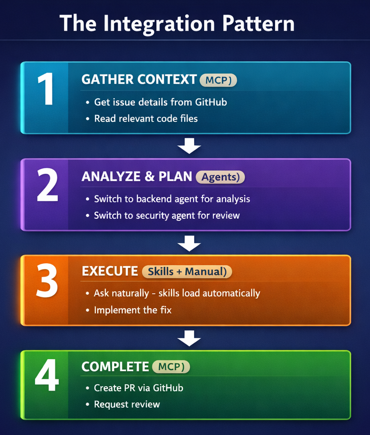

> **你學到的一切都在這裡結合。在單個階段中，從想法到合併 PR 一氣呵成。**

在本章中，你將把學到的一切彙整成完整的工作流程。你將使用多代理程式協作來建構功能、設定能在提交前攔截安全問題的預先提交掛鉤 (pre-commit hooks)、將 Copilot 整合到 CI/CD 管線中，並在單個終端機階段中完成從功能構想到合併 PR 的全過程。這就是 GitHub Copilot CLI 成為真正生產力倍增器的地方。

> 💡 **注意**：本章展示了如何結合你所學到的一切。**你不需要代理程式、技能或 MCP 也能發揮生產力 (儘管它們非常有幫助)。** 核心工作流程——描述、計畫、實作、測試、審查、交付——僅使用第 00-03 章中的內建功能即可運作。

## 🎯 學習目標

到本章結束時，你將能夠：

- 在統一的工作流程中結合代理程式、技能與 MCP (模型內容協定)
- 使用多工具方法建構完整的功能
- 使用掛鉤 (hooks) 設定基礎自動化
- 套用專業開發的最佳實作

> ⏱️ **預估時間**：~75 分鐘 (15 分鐘閱讀 + 60 分鐘動手實作)

---

## 🧩 現實世界的類比：管弦樂團


一個交響樂團有許多聲部：
- **弦樂 (Strings)** 提供基礎 (就像你的核心工作流程)
- **銅管 (Brass)** 增加力量 (就像具備專業知識的代理程式)
- **木管 (Woodwinds)** 增添色彩 (就像擴展能力的技能)
- **打擊樂 (Percussion)** 維持節奏 (就像連接外部系統的 MCP)

個別來看，每個聲部都顯得有限。但結合在一起並指揮得當時，它們能創造出壯麗的樂章。

**這就是本章要教的！**<br>
*就像管弦樂團的指揮一樣，你將代理程式、技能和 MCP 編排成統一的工作流程*

讓我們從一個修改程式碼、產生測試、進行審查並建立 PR 的情境開始——全都在一個階段中完成。

---

## 在一個階段中從想法到合併 PR

與其在編輯器、終端機、測試執行器和 GitHub UI 之間來回切換並每次都失去內容，你可以將所有工具結合成一個終端機階段。我們將在下方的 [整合模式](#整合模式-給進階使用者的建議) 章節中分解此模式。

```bash
# 在互動模式下啟動 Copilot
copilot

> I need to add a "list unread" command to the book app that shows only
> books where read is False. What files need to change?

# Copilot 建立高階計畫...

# 切換到 PYTHON-REVIEWER 代理程式
> /agent
# 選擇 "python-reviewer"

> @samples/book-app-project/books.py Design a get_unread_books method.
> What is the best approach?

# python-reviewer 代理程式產生：
# - 方法簽名與回傳類型
# - 使用列表推導式 (list comprehension) 的篩選實作
# - 對空收藏的邊際情況處理

# 切換到 PYTEST-HELPER 代理程式
> /agent
# 選擇 "pytest-helper"

> @samples/book-app-project/tests/test_books.py Design test cases for
> filtering unread books.

# pytest-helper 代理程式產生：
# - 空收藏的測試案例
# - 混合已讀/未讀書籍的測試案例
# - 全為已讀書籍的測試案例

# 實作 (IMPLEMENT)
> Add a get_unread_books method to BookCollection in books.py
> Add a "list unread" command option in book_app.py
> Update the help text in the show_help function

# 測試 (TEST)
> Generate comprehensive tests for the new feature

# 產生多個類似以下的測試：
# - 成功路徑 (3 個測試) — 正確篩選、排除已讀、包含未讀
# - 邊際情況 (4 個測試) — 空收藏、全為已讀、無一已讀、單本書籍
# - 參數化 (5 個案例) — 透過 @pytest.mark.parametrize 測試不同的已讀/未讀比例
# - 整合 (4 個測試) — 與 mark_as_read、remove_book、add_book 的相互作用及資料完整性

# 審查變更
> /review

# 若審查通過，使用 /pr 在目前分支上對 pull request 進行操作
> /pr [view|create|fix|auto]

# 或以自然語句要求 Copilot 從終端機協助草擬
> Create a pull request titled "Feature: Add list unread books command"
```

**傳統做法**：在編輯器、終端機、測試執行器、文件和 GitHub UI 之間切換。每次切換都會導致內容遺失和磨損。

**核心洞察**：你像建築師一樣指揮專家。他們處理細節，你負責願景。

> 💡 **更進一步**：對於像這樣的大型多步驟計畫，嘗試使用 `/fleet` 讓 Copilot 平行執行獨立的子任務。詳情請參閱 [官方文件](https://docs.github.com/copilot/concepts/agents/copilot-cli/fleet)。

---

# 其他工作流程


對於已完成第 04-06 章的進階使用者，這些工作流程展示了代理程式、技能和 MCP 如何倍增你的成效。

## 整合模式

這是結合一切的心智模型：



---

## 工作流程 1：漏洞調查與修正

具備完整工具整合的真實世界漏洞修正：

```bash
copilot

# 階段 1：透過 GitHub 理解漏洞 (MCP 提供此功能)
> Get the details of issue #1

# 瞭解到：「find_by_author 對部分姓名無效」

# 階段 2：研究最佳實作 (透過網頁 + GitHub 來源進行深度研究)
> /research Best practices for Python case-insensitive string matching

# 階段 3：尋找相關程式碼
> @samples/book-app-project/books.py Show me the find_by_author method

# 階段 4：取得專家分析
> /agent
# 選擇 "python-reviewer"

> Analyze this method for issues with partial name matching

# 代理程式識別出：方法使用了精確相等而非子字串匹配

# 階段 5：在代理程式引導下進行修正
> Implement the fix using lowercase comparison and 'in' operator

# 階段 6：產生測試
> /agent
# 選擇 "pytest-helper"

> Generate pytest tests for find_by_author with partial matches
> Include test cases: partial name, case variations, no matches

# 階段 7：提交與 PR
> Generate a commit message for this fix

> Create a pull request linking to issue #1
```

---

## 工作流程 2：程式碼審查自動化 (選修)

> 💡 **本節是選修內容。** 預先提交掛鉤 (Pre-commit hooks) 對團隊很有用，但並非發揮生產力的必要條件。如果你剛開始接觸，可以跳過此處。
>
> ⚠️ **效能備註**：此掛鉤會為每個暫存檔案呼叫 `copilot -p`，每個檔案需要幾秒鐘。對於大型提交，請考慮僅限於關鍵檔案，或使用 `/review` 手動執行審查。

**git 掛鉤 (git hook)** 是 Git 在特定時間點 (例如在提交之前) 自動執行的指令碼。你可以使用它對程式碼執行自動檢查。以下是如何在你的提交上設定自動 Copilot 審查：

```bash
# 建立預先提交掛鉤
cat > .git/hooks/pre-commit << 'EOF'
#!/bin/bash

# 取得已暫存檔案 (僅限 Python 檔案)
STAGED=$(git diff --cached --name-only --diff-filter=ACM | grep -E '\.py$')

if [ -n "$STAGED" ]; then
  echo "Running Copilot review on staged files..."

  for file in $STAGED; do
    echo "Reviewing $file..."

    # 使用逾時防止當機 (每個檔案 60 秒)
    # --allow-all 會自動核准檔案讀取/寫入，以便掛鉤可以在無人值守的情況下執行。
    # 僅在自動化指令碼中使用此選項。在互動階段中，請讓 Copilot 徵求許可。
    REVIEW=$(timeout 60 copilot --allow-all -p "Quick security review of @$file - critical issues only" 2>/dev/null)

    # 檢查是否發生逾時
    if [ $? -eq 124 ]; then
      echo "Warning: Review timed out for $file (skipping)"
      continue
    fi

    if echo "$REVIEW" | grep -qi "CRITICAL"; then
      echo "Critical issues found in $file:"
      echo "$REVIEW"
      exit 1
    fi
  done

  echo "Review passed"
fi
EOF

chmod +x .git/hooks/pre-commit
```

> ⚠️ **macOS 使用者**：macOS 預設不包含 `timeout` 指令。請使用 `brew install coreutils` 安裝它，或將 `timeout 60` 替換為不帶逾時防護的簡單呼叫。

> 📚 **官方文件**：[使用掛鉤 (Use hooks)](https://docs.github.com/copilot/how-tos/copilot-cli/use-hooks) 以及 [掛鉤設定參考 (Hooks configuration reference)](https://docs.github.com/copilot/reference/hooks-configuration) 以獲取完整的掛鉤 API。
>
> 💡 **內建替代方案**：Copilot CLI 也有一個內建的掛鉤系統 (`copilot hooks`)，可以在預先提交等事件中自動執行。上方的手動 git 掛鉤為你提供了完全的控制權，而內建系統則更易於設定。請參閱上述文件以決定哪種方法適合你的工作流程。

現在每次提交都會獲得快速的安全審查：

```bash
git add samples/book-app-project/books.py
git commit -m "Update book collection methods"

# 輸出：
# Running Copilot review on staged files...
# Reviewing samples/book-app-project/books.py...
# Critical issues found in samples/book-app-project/books.py:
# - Line 15: File path injection vulnerability in load_from_file
#
# Fix the issue and try again.
```

---

## 工作流程 3：快速上手新程式碼庫

加入新專案時，結合內容、代理程式和 MCP 以快速進入狀態：

```bash
# 在互動模式下啟動 Copilot
copilot

# 階段 1：透過內容瞭解大局
> @samples/book-app-project/ Explain the high-level architecture of this codebase

# 階段 2：理解特定流程
> @samples/book-app-project/book_app.py Walk me through what happens
> when a user runs "python book_app.py add"

# 階段 3：使用代理程式進行專家分析
> /agent
# 選擇 "python-reviewer"

> @samples/book-app-project/books.py Are there any design issues,
> missing error handling, or improvements you would recommend?

# 階段 4：尋找可以著手的工作 (MCP 提供 GitHub 存取)
> List open issues labeled "good first issue"

# 階段 5：開始貢獻
> Pick the simplest open issue and outline a plan to fix it
```

此工作流程將 `@` 內容、代理程式和 MCP 結合成單一的上手階段，正是本章早些時候提到的整合模式。

---

# 最佳實作與自動化

讓你的工作流程更有效的模式與習慣。

---

## 最佳實作

### 1. 分析前先從內容開始

在要求分析之前，務必先收集內容：

```bash
# 好的做法
> Get the details of issue #42
> /agent
# 選擇 python-reviewer
> Analyze this issue

# 效果較差的做法
> /agent
# 選擇 python-reviewer
> Fix login bug
# 代理程式沒有 issue 的內容
```

### 2. 瞭解差異：代理程式、技能與自訂指示

每種工具都有其擅長之處：

```bash
# 代理程式 (Agents)：你明確啟用的專門人格
> /agent
# 選擇 python-reviewer
> Review this authentication code for security issues

# 技能 (Skills)：當你的提示符合技能說明時自動啟用的模組化能力
# (你必須先建立它們 — 參見第 05 章)
> Generate comprehensive tests for this code
# 如果你設定了測試技能，它會自動啟用

# 自訂指示 (.github/copilot-instructions.md)：
# 適用於每個階段的始終開啟的指引，無需切換或觸發
```

> 💡 **核心重點**：代理程式和技能都可以分析和產生程式碼。真正的區別在於**它們如何啟用**——代理程式是顯式的 (`/agent`)，技能是自動的 (提示匹配)，而自訂指示是始終開啟的。

### 3. 保持階段專注

使用 `/rename` 為你的階段貼上標籤 (方便在歷史紀錄中尋找)，並使用 `/exit` 清潔地結束它：

```bash
# 好的做法：每個功能一個階段
> /rename list-unread-feature
# 處理列出未讀功能
> /exit

copilot
> /rename export-csv-feature
# 處理 CSV 匯出功能
> /exit

# 效果較差的做法：所有內容都在一個長階段中
```

### 4. 使用 Copilot 讓工作流程可重複使用

不要只是在維基 (wiki) 中記錄工作流程，而要直接在你的儲存庫中對其進行編碼，以便 Copilot 可以使用它們：

- **自訂指示** (`.github/copilot-instructions.md`)：針對編碼標準、架構規則以及建構/測試/部署步驟的始終開啟的指引。每個階段都會自動遵循它們。
- **提示檔案** (`.github/prompts/`)：團隊可以共享的可重複使用的、帶參數的提示——例如程式碼審查、元件產生或 PR 說明的模板。
- **自訂代理程式** (`.github/agents/`)：編碼專門的人格 (例如安全審查員或文件撰寫者)，團隊中的任何人都可以使用 `/agent` 啟用。
- **自訂技能** (`.github/skills/`)：打包相關時會自動觸發的逐步工作流程指示。

> 💡 **收益**：新團隊成員可以免費獲得你的工作流程——它們已內建於儲存庫中，而不是鎖在某些人的腦袋裡。

---

## 加分：正式環境模式

這些模式雖然是選修的，但對於專業環境非常有價值。

### PR 說明產生器

```bash
# 產生全面的 PR 說明
BRANCH=$(git branch --show-current)
COMMITS=$(git log main..$BRANCH --oneline)

copilot -p "Generate a PR description for:
Branch: $BRANCH
Commits:
$COMMITS

Include: Summary, Changes Made, Testing Done, Screenshots Needed"
```

### CI/CD 整合

對於擁有現有 CI/CD 管線的團隊，你可以使用 GitHub Actions 自動對每個提取請求執行 Copilot 審查。這包括自動發布審查評論以及篩選關鍵問題。

> 📖 **瞭解更多**：參閱 [CI/CD 整合](../appendices/ci-cd-integration.md) 以獲取完整的 GitHub Actions 工作流程、設定選項和疑難排解提示。

---

# 練習


將完整的工作流程投入實踐。

---

## ▶️ 親自嘗試

完成展示後，嘗試這些變化：

1. **端對端挑戰**：挑選一個小功能 (例如「列出未讀書籍」或「匯出為 CSV」)。使用完整的工作流程：
   - 使用 `/plan` 規劃
   - 使用代理程式進行設計 (python-reviewer, pytest-helper)
   - 實作
   - 產生測試
   - 建立 PR

2. **自動化挑戰**：設定來自「程式碼審查自動化」工作流程的預先提交掛鉤。進行一次帶有故意設計的檔案路徑漏洞的提交。它是否被攔截了？

3. **你的正式生產工作流程**：為你常做的一項任務設計自己的工作流程。將其寫成一份檢查表。哪些部分可以透過技能、代理程式或掛鉤來自動化？

**自我檢查**：當你能向同事解釋代理程式、技能和 MCP 如何協同工作，以及何時使用每一種時，你就完成了本課程。

---

## 📝 作業

### 主要挑戰：端對端功能開發

動手實作範例引導了建構「列出未讀書籍」功能的過程。現在針對另一個功能練習完整的工作流程：**按年份範圍搜尋書籍**：

1. 啟動 Copilot 並收集內容：`@samples/book-app-project/books.py`
2. 使用 `/plan` 規劃：「Add a "search by year" command that lets users find books published between two years」
3. 在 `BookCollection` 中實作一個 `find_by_year_range(start_year, end_year)` 方法
4. 在 `book_app.py` 中新增一個 `handle_search_year()` 函式，提示使用者輸入起始和結束年份
5. 產生測試：`@samples/book-app-project/books.py @samples/book-app-project/tests/test_books.py Generate tests for find_by_year_range() including edge cases like invalid years, reversed range, and no results.`
6. 使用 `/review` 進行審查
7. 更新 README：`@samples/book-app-project/README.md Add documentation for the new "search by year" command.`
8. 產生一條提交訊息

邊進行邊記錄你的工作流程。

**成功標準**：你已使用 Copilot CLI 完成從想法到提交的功能開發，包括規劃、實作、測試、文件化和審查。

> 💡 **加分**：如果你已經從第 04 章設定好了代理程式，嘗試建立並使用自訂代理程式。例如，使用錯誤處理 (error-handler) 代理程式進行實作審查，以及使用文件撰寫 (doc-writer) 代理程式進行 README 更新。

<details>
<summary>💡 提示 (點擊展開)</summary>

**遵循本章頂部 [「從想法到合併 PR」](#在一個階段中從想法到合併-pr) 範例中的模式**。關鍵步驟為：

1. 使用 `@samples/book-app-project/books.py` 收集內容
2. 使用 `/plan Add a "search by year" command` 規劃
3. 實作方法和指令處理程式
4. 產生帶有邊際情況的測試 (無效輸入、空結果、反向範圍)
5. 使用 `/review` 審查
6. 使用 `@samples/book-app-project/README.md` 更新 README
7. 使用 `-p` 產生提交訊息

**需要考慮的邊際情況：**
- 如果使用者輸入 "2000" 和 "1990" (反向範圍) 會怎樣？
- 如果沒有書籍符合該範圍會怎樣？
- 如果使用者輸入非數字內容會怎樣？

**關鍵在於練習從 想法 → 內容 → 計畫 → 實作 → 測試 → 文件化 → 提交 的完整工作流程。**

</details>

---

<details>
<summary>🔧 <strong>常見錯誤</strong> (點擊展開)</summary>

| 錯誤 | 會發生什麼 | 修正 |
|---------|--------------|-----|
| 直接跳到實作 | 遺漏設計問題，日後修復成本很高 | 先使用 `/plan` 思考完整方法 |
| 僅使用單一工具，而多種工具組合會更有幫助 | 結果較慢且不夠徹底 | 結合使用：代理程式用於分析 → 技能用於執行 → MCP 用於整合 |
| 提交前未進行審查 | 安全問題或程式碼漏洞悄悄溜過 | 務必執行 `/review` 或使用 [預先提交掛鉤](#工作流程-2-程式碼審查自動化-選修) |
| 忘記與團隊共享工作流程 | 每個人都在重新發明輪子 | 在共享的代理程式、技能和指示中記錄模式 |

</details>

---

# 摘要

## 🔑 重要關鍵

1. **整合 > 孤立**：結合多種工具以發揮最大影響力
2. **內容優先**：在分析之前務必先收集所需的內容
3. **代理程式負責分析，技能負責執行**：為任務選擇正確的工具
4. **自動化重複工作**：掛鉤和指令碼可以倍增你的成效
5. **文件化工作流程**：可共享的模式能造福整個團隊

> 📋 **快速參考**：查看 [GitHub Copilot CLI 指令參考](https://docs.github.com/en/copilot/reference/cli-command-reference) 以獲取指令和快速鍵的完整清單。

---

## ✅ 課程完成！

恭喜！你已學會：

| 章節 | 學習內容 |
|---------|-------------------|
| 00 | Copilot CLI 安裝與快速入門 |
| 01 | 三種互動模式 |
| 02 | 使用 @ 語法進行內容管理 |
| 03 | 開發工作流程 |
| 04 | 專門的代理程式 |
| 05 | 可擴展的技能 |
| 06 | 使用 MCP 進行外部連接 |
| 07 | 統一的正式生產工作流程 |

你現在已具備將 GitHub Copilot CLI 作為開發工作流程中真正生產力倍增器的能力。

## ➡️ 下一步

你的學習並不止於此：

1. **每日實踐**：在真實工作中使用 Copilot CLI
2. **建構自訂工具**：為你的特定需求建立代理程式和技能
3. **分享知識**：幫助你的團隊採用這些工作流程
4. **保持更新**：關注 GitHub Copilot 的更新以獲取新功能

### 資源

- [GitHub Copilot CLI 文件](https://docs.github.com/copilot/concepts/agents/about-copilot-cli)
- [MCP 伺服器登錄表 (Registry)](https://github.com/modelcontextprotocol/servers)
- [社群技能](https://github.com/topics/copilot-skill)

---

**幹得好！現在去建構一些了不起的東西吧。**

**[← 返回第 06 章](../06-mcp-servers/README.md)** | **[返回課程首頁 →](../README.md)**
